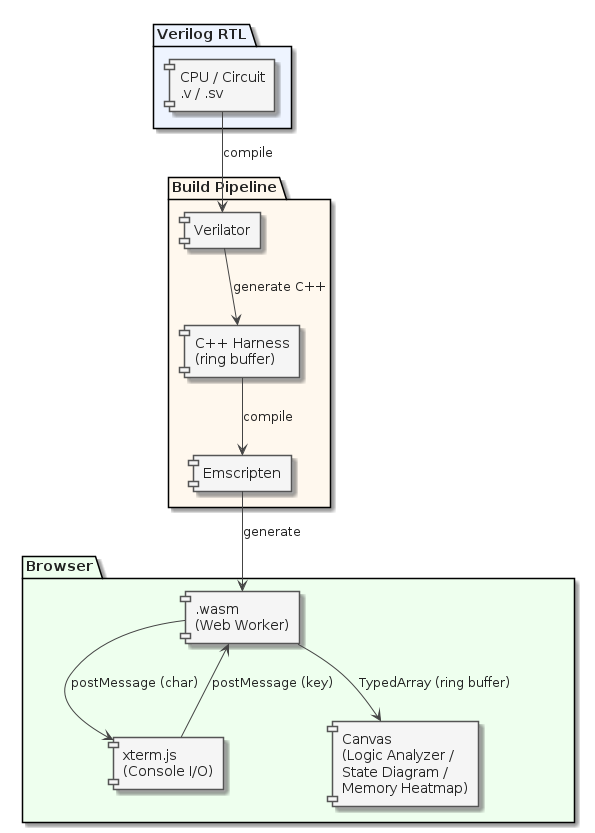
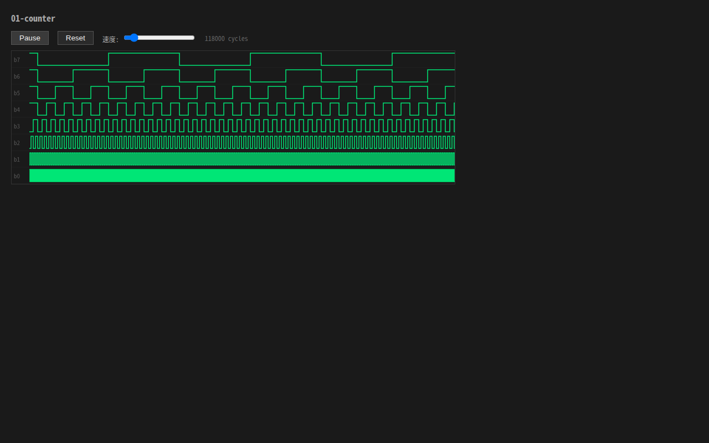
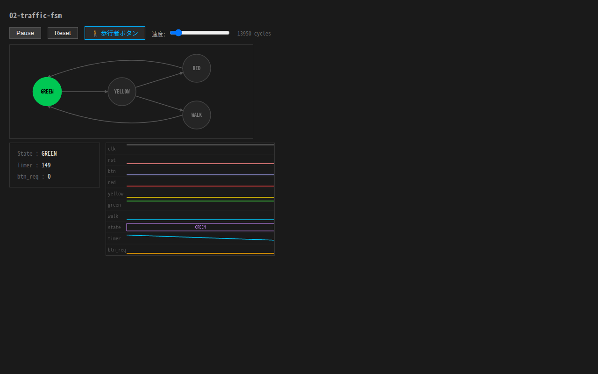
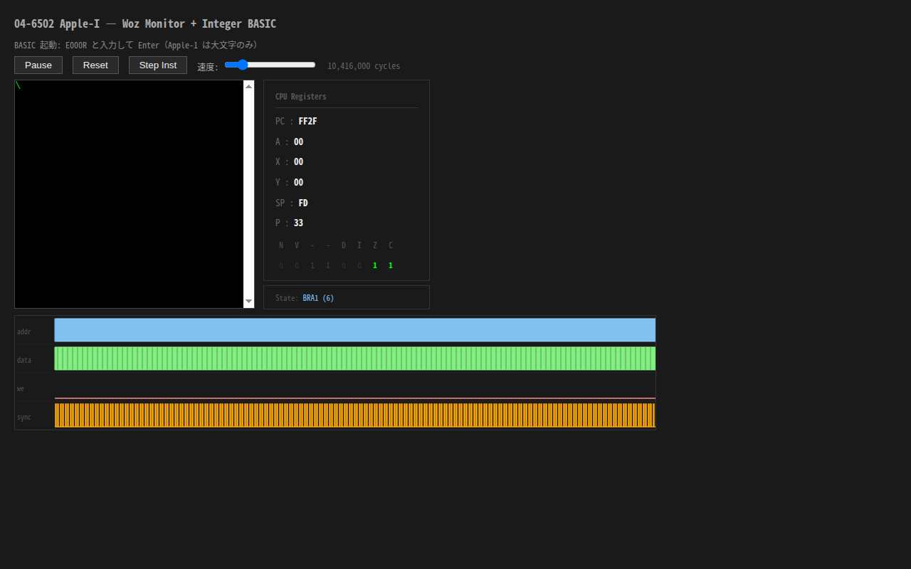
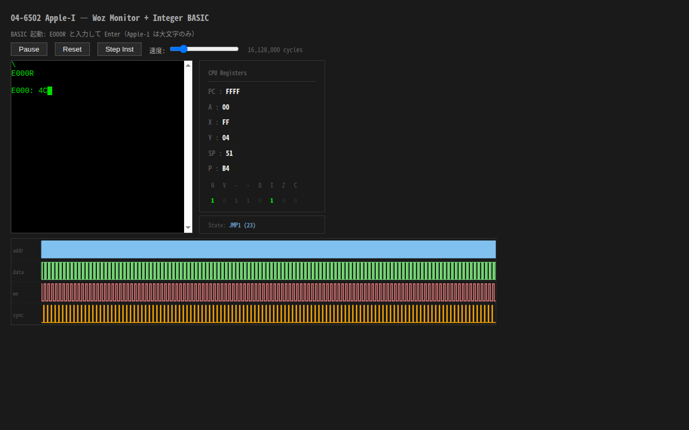

# soft-FPGA × WebAssembly

[English](README.md) | [日本語](README.ja.md)

Verilog で書いたレトロ CPU / デジタル回路を Verilator で C++ 化し、Emscripten で WebAssembly に変換して
ブラウザ上で動かすプロジェクト。速度より**内部信号のリアルタイム可視化**（T-state・マイクロシーケンサ・
バス波形など）が核心価値。命令エミュレータには存在しない内部信号をブラウザ上で観測できる。

## 題材選定の基準

- **歴史的価値があるアーキテクチャ** — 当時の産業・文化を変えた CPU / 回路であること
- **実績のある Verilog ソースが公開されている** — デキャップ起こし・MiSTer 実装など検証済みの RTL が入手できること
- **私（tommie.jp）が楽しめる** — 作っていて面白い、動かして感動がある

## 可視化ライブラリ rtlscope

RTL 内部信号をブラウザで宣言的に観測するライブラリ。

| 層 | 役割 |
| --- | --- |
| C++ ハーネス層 | 毎クロック ring buffer にサンプリング |
| JS 描画層 | TypedArray ビュー経由でゼロコピー読取、60Hz 描画 |

## ライブデモ

**[https://tommie-jp.github.io/soft-fpga/](https://tommie-jp.github.io/soft-fpga/)**

## アーキテクチャ



## ギャラリー

| 01-counter | 02-traffic-fsm | 04-6502 Woz Monitor | 04-6502 Integer BASIC |
| --- | --- | --- | --- |
| [](docs/img/ss/01-counter.png) | [](docs/img/ss/02-traffic-fsm.png) | [](docs/img/ss/04-6502-wozmon.png) | [](docs/img/ss/04-6502-basic.png) |
| 8bit カウンタの波形を Logic Analyzer で観測 | 現在の FSM 状態をリアルタイムにハイライト | 6502 CPU レジスタとバス信号をリアルタイム表示 | シミュレーション上の 6502 で Integer BASIC を実行 |

## ロードマップ

| フェーズ | 題材 | 目的 | 状態 |
| --- | --- | --- | --- |
| 基礎 1 | 二進カウンタ | ring buffer → TypedArray → Canvas の最小検証 | ✅ 完了 |
| 基礎 2 | 信号機 FSM | State Diagram ビューお披露目 | ✅ 完了 |
| 基礎 3 | UART 送受信機 | Logic Analyzer ビューの威力確認 | ✅ 完了 |
| CPU 第一弾 | 6502 / Apple-I | 対話体験（wozmon → Integer BASIC） | ✅ 完了 |
| CPU 第二弾 | 8080 / CP/M 2.2 | vm80a RTL + CP/M 2.2 + BDS C コンパイラ | ✅ 完了 |
| 基礎 4〜10 | LFSR / シーケンス検出器 / PWM / FIFO / SPI / I2C | 教材網羅 | 🔲 予定 |
| ゲーム | Pong / Breakout | ディスクリート論理回路の可視化ショーケース | 🔲 予定 |
| CPU 第三弾 | 4004 / Busicom | 命令エミュに作れない可視化の決定的証明 | 🔲 予定 |
| CPU 第四弾 | Z80 | Pico 2 側ロードマップと同期 | 🔲 予定 |

## Getting started

```bash
git clone https://github.com/tommie-jp/soft-fpga.git
cd soft-fpga
git submodule update --init
```

## ビルド

```bash
# Docker 開発環境を起動
docker compose -f docker/compose.yml run --rm dev

# ネイティブ Linux シミュレーション
scripts/build-host.sh

# WebAssembly ビルド
scripts/build-wasm.sh       # → examples/01-counter/web/（デフォルト）
scripts/build-wasm-06.sh    # → examples/06-8080/web/sim.js, sim.wasm

# ローカルブラウザ確認（ソース更新時自動リビルド + HTTP サーバ起動）
cd examples/06-8080/web && ./doStart.sh
# ブラウザで http://localhost:8000/ を開く

# GitHub Pages へのデプロイ（全エグザンプル）
scripts/deploy-gh-pages.sh
```

## ディレクトリ構成

| Path | 役割 |
| --- | --- |
| [`examples/`](examples/) | 回路サンプル（各 example に verilog / cxx / web） |
| [`web/`](web/) | GitHub Pages ルート目次ページ |
| [`cxx/`](cxx/) | C++ ハーネス共通ヘッダ（libRTLScope） |
| [`scripts/`](scripts/) | ビルド・デプロイ・テスト補助スクリプト |
| [`docker/`](docker/) | 開発環境（Ubuntu 24.04 + Verilator + Emscripten + cocotb） |
| [`firmware/`](firmware/) | Pico SDK ファームウェア（将来の Pico 2 ターゲット） |
| [`docs/`](docs/) | 設計ドキュメント |

## 関連資料

- [`docs/01-soft-FPGA-WebAssembly-設計議論メモ.md`](docs/01-soft-FPGA-WebAssembly-設計議論メモ.md) — 設計方針・ロードマップ・ライブラリ構想

## License

MIT
