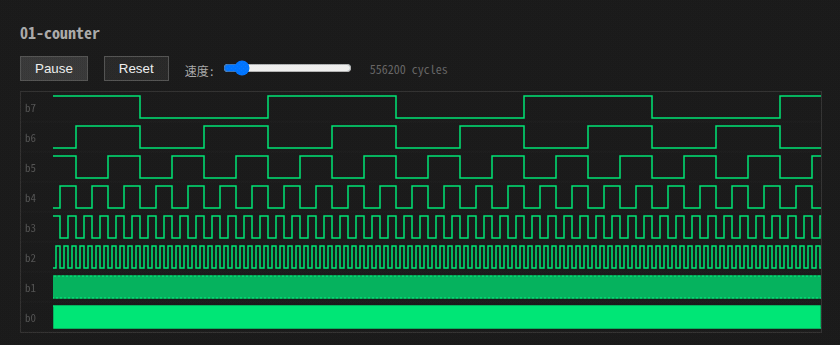
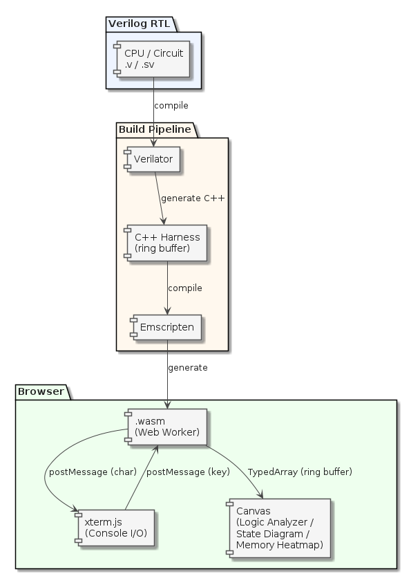
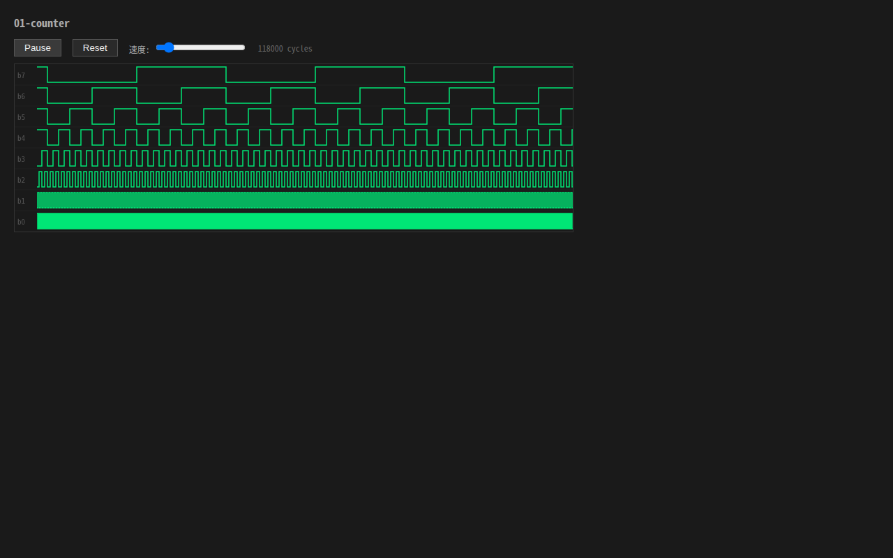
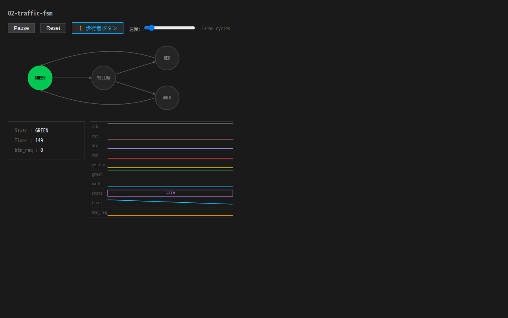
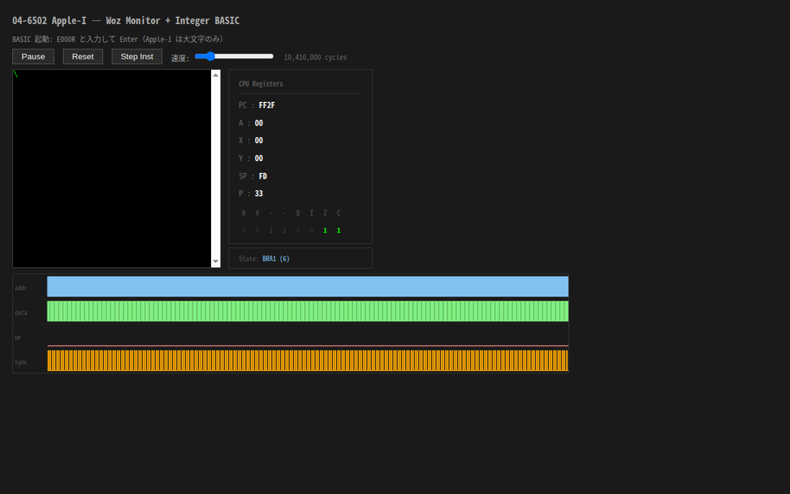
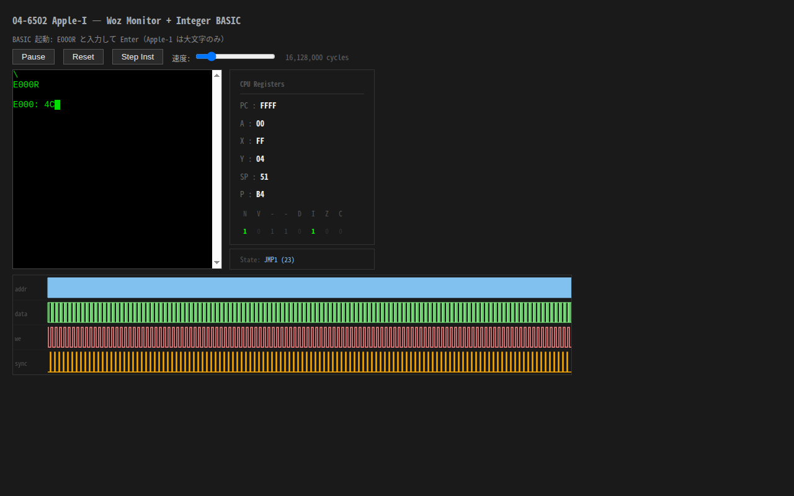
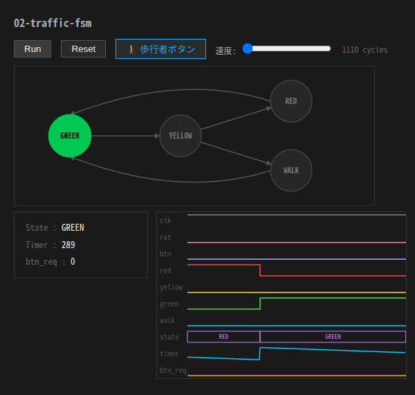
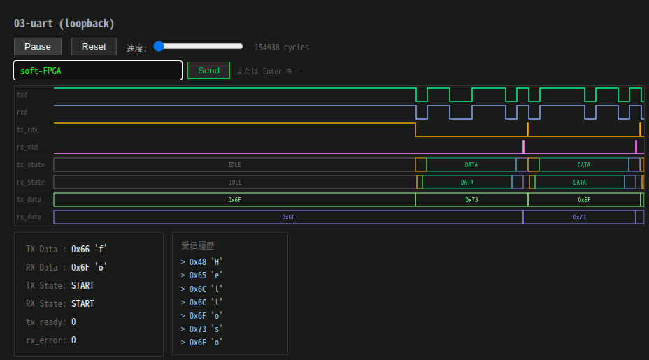
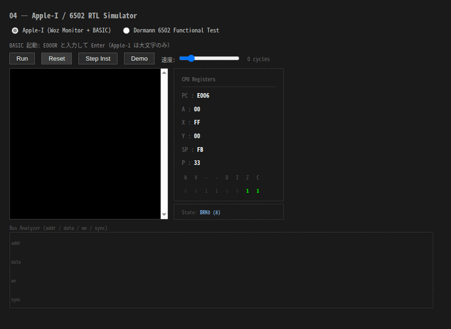
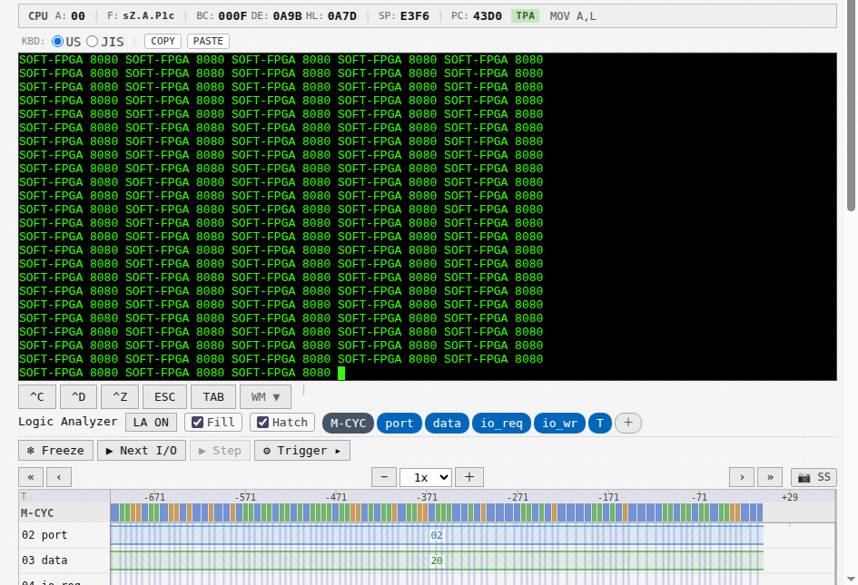

# soft-FPGA × WebAssembly

[English](README.md) | [日本語](README.ja.md)

[](https://github.com/tommie-jp/soft-fpga/actions/workflows/ci.yml)
[](LICENSE)

Simulate Verilog-written retro CPUs and digital circuits via Verilator + Emscripten,
and run them in the browser. The core value is not speed but **real-time visualization
of internal signals** — T-states, microsequencers, bus waveforms — things no
instruction-level emulator can show.



*Live waveforms from a Verilog binary counter: 8 register bits sampled every clock cycle and rendered at 60 Hz in the browser. [Try it live ▶](https://tommie-jp.github.io/soft-fpga/01-counter/)*

## Subject selection criteria

- **Historically significant architecture** — CPUs and circuits that changed industry or culture in their era
- **Proven Verilog source available** — verified RTL obtainable (decap-derived, MiSTer implementations, etc.)
- **Fun for me (tommie.jp)** — satisfying to build, exciting to run

## Visualization library: rtlscope

A library for declaratively observing RTL internal signals in the browser.

| Layer | Role |
| --- | --- |
| C++ harness | Sample every clock cycle into a ring buffer |
| JS rendering | Zero-copy read via TypedArray view, 60 Hz canvas rendering |

## Live demo

**[https://tommie-jp.github.io/soft-fpga/](https://tommie-jp.github.io/soft-fpga/)**

## Architecture



## Gallery

| 01-counter | 02-traffic-fsm | 04-6502 Woz Monitor | 04-6502 Integer BASIC |
| --- | --- | --- | --- |
| [](docs/img/ss/01-counter.png) | [](docs/img/ss/02-traffic-fsm.png) | [](docs/img/ss/04-6502-wozmon.png) | [](docs/img/ss/04-6502-basic.png) |
| 8-bit counter waveforms in Logic Analyzer | FSM state highlighted in real time | 6502 CPU registers and bus signals live | Integer BASIC running on the simulated 6502 |

### Animated captures

**02 — Traffic-light FSM** — a 3-phase signal with a pedestrian button. The State Diagram highlights the live state (`GREEN`→`YELLOW`→`RED`→`WALK`) while the logic analyzer shows the same transition on the output signals. [Open ▶](https://tommie-jp.github.io/soft-fpga/02-traffic-fsm/)



**03 — UART (loopback)** — transmitting `soft-FPGA` over the serial line: start / data / stop bits on `txd`/`rxd`, the TX and RX state machines, and the byte on the data bus, all sampled live. [Open ▶](https://tommie-jp.github.io/soft-fpga/03-uart/)



**04 — Apple-I / 6502** — Integer BASIC running on the 6502 RTL core: assigns `A=1`, `B=20`, evaluates `A+B = 21`, and exits. CPU registers, the **microsequencer state** (`JSR2`, `BRA0`, …) and the address / data / we / sync bus update every clock cycle — internal signals an instruction-level emulator does not have. [Open ▶](https://tommie-jp.github.io/soft-fpga/04-6502/)



**06 — Intel 8080 / CP/M 2.2** — BDS C compile-run cycle on the vm80a (decapped-die) 8080 RTL under CP/M 2.2: `DIR` → `B:` → `TYPE HELLO.C` → `CC HELLO` → `CLINK HELLO` → `HELLO`. From source file to "Hello, CP/M!" in one session. CPU registers and the **I/O Bus Analyzer** update live throughout. [Open ▶](https://tommie-jp.github.io/soft-fpga/06-8080/)



## Design notes — what made this hard

A few non-obvious problems behind the "just run RTL in the browser" pitch. Full write-up in [docs/01-soft-FPGA-WebAssembly-設計議論メモ.md](docs/01-soft-FPGA-WebAssembly-設計議論メモ.md).

- **Never cross the Wasm↔JS boundary every cycle.** A per-cycle `EM_ASM`/`EM_JS` callback collapses under call overhead. rtlscope writes each sample into a ring buffer in Wasm memory; JS reads it zero-copy through a `TypedArray` view over `HEAP8.buffer` and renders at 60 Hz with `requestAnimationFrame`.
- **`ALLOW_MEMORY_GROWTH=1` silently invalidates those views.** When the Wasm heap grows, the old `ArrayBuffer` is detached and the view goes blank mid-run, so the harness watches for growth and regenerates the views.
- **Verilator hierarchical signal names are not stable.** `top->cpu__DOT__regs__DOT__pc` shifts with the Verilator version and `--public-flat-rw` is brittle. Observed signals are pulled out through a thin Verilog wrapper at the top level and bound in the C++ harness, so the JS side never depends on internal naming.
- **VCD dump is a non-starter in Wasm** — the in-Wasm filesystem fills instantly, so all tracing goes through the custom ring buffer instead.
- **The simulation has to run in a Web Worker.** On the main thread the UI freezes; the fast path needs `SharedArrayBuffer` + Atomics, which pulls in COOP/COEP headers.
- **The core claim, precisely:** an instruction-level emulator has no T-states, microsequencer, or combinational-propagation signals to expose — not hidden, *absent*. soft-FPGA runs the circuit, so those signals exist and can be observed (see the 6502 capture above).

## Roadmap

| Phase | Subject | Goal | Status |
| --- | --- | --- | --- |
| Basic 1 | Binary counter | Minimal ring buffer → TypedArray → Canvas pipeline | ✅ Done |
| Basic 2 | Traffic light FSM | State Diagram view debut | ✅ Done |
| Basic 3 | UART transceiver | Logic Analyzer view in action | ✅ Done |
| CPU #1 | 6502 / Apple-I | Interactive experience (wozmon → Integer BASIC) | ✅ Done |
| CPU #2 | 8080 / CP/M 2.2 | CP/M 2.2 + BDS C compiler on vm80a RTL | ✅ Done |
| Basic 4–10 | LFSR / sequence detector / PWM / FIFO / SPI / I2C | Curriculum coverage | 🔲 Planned |
| Game | Pong / Breakout | Discrete-logic visualization showcase | 🔲 Planned |
| CPU #3 | 4004 / Busicom | Definitive proof of visualization beyond instruction emulators | 🔲 Planned |
| CPU #4 | Z80 | Sync with Pico 2 roadmap | 🔲 Planned |

## Getting started

```bash
git clone https://github.com/tommie-jp/soft-fpga.git
cd soft-fpga
git submodule update --init
```

## Build

```bash
# Start the Docker dev environment
docker compose -f docker/compose.yml run --rm dev

# Native Linux simulation
scripts/build-host.sh

# WebAssembly build
scripts/build-wasm.sh       # → examples/01-counter/web/  (default)
scripts/build-wasm-06.sh    # → examples/06-8080/web/sim.js, sim.wasm

# Local browser test (auto-rebuild if sources changed + HTTP server)
cd examples/06-8080/web && ./doStart.sh
# open http://localhost:8000/

# Deploy all examples to GitHub Pages
scripts/deploy-gh-pages.sh
```

## Directory layout

| Path | Role |
| --- | --- |
| [`examples/`](examples/) | Circuit samples (each has verilog / cxx / web) |
| [`web/`](web/) | Root index page for GitHub Pages |
| [`cxx/`](cxx/) | Shared C++ harness headers (libRTLScope) |
| [`scripts/`](scripts/) | Build, deploy, and test helper scripts |
| [`docker/`](docker/) | Dev environment (Ubuntu 24.04 + Verilator + Emscripten + cocotb) |
| [`firmware/`](firmware/) | Pico SDK firmware (future Pico 2 target) |
| [`docs/`](docs/) | Design documents (Japanese) |

## License

MIT
