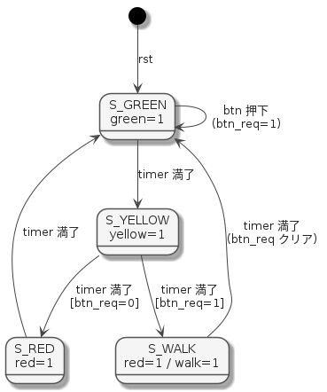
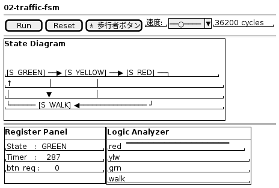

# 実装計画：02-traffic-fsm

## 位置づけ

Tier 1 第 2 弾。カウンタ（Logic Analyzer）の次に **State Diagram ビューをお披露目**する題材。
歩行者ボタン付き信号機 FSM を通じて「状態遷移が目で見える」体験を作る。

---

## 仕様

### 入出力

| 信号 | 方向 | 意味 |
| --- | --- | --- |
| `clk` | in | クロック |
| `rst` | in | 同期リセット |
| `btn` | in | 歩行者ボタン（1 クロック押下） |
| `red` | out | 車道：赤 |
| `yellow` | out | 車道：黄 |
| `green` | out | 車道：青 |
| `walk` | out | 歩行者：進め |

### 状態定義

```text
S_GREEN  (2'b00) : 車道青  緑=1  （デフォルト循環）
S_YELLOW (2'b01) : 車道黄  黄=1  （常に GREEN 後に経由）
S_RED    (2'b10) : 車道赤  赤=1  （btn_req なし時に YELLOW から遷移）
S_WALK   (2'b11) : 歩行者  赤=1 walk=1  （btn_req あり時に YELLOW から遷移）
```

### 状態遷移



> ソース: [`doc/img/02-traffic-fsm-state.puml`](img/02-traffic-fsm-state.puml)

### 状態遷移表

| 現在状態 | 条件 | 次状態 | red | yellow | green | walk |
| --- | --- | --- | :---: | :---: | :---: | :---: |
| `S_GREEN` | timer 未満了 / btn=0 | `S_GREEN` | 0 | 0 | 1 | 0 |
| `S_GREEN` | timer 未満了 / btn=1 | `S_GREEN`（btn_req=1） | 0 | 0 | 1 | 0 |
| `S_GREEN` | timer 満了 | `S_YELLOW` | 0 | 1 | 0 | 0 |
| `S_YELLOW` | timer 未満了 | `S_YELLOW` | 0 | 1 | 0 | 0 |
| `S_YELLOW` | timer 満了 / btn_req=0 | `S_RED` | 1 | 0 | 0 | 0 |
| `S_YELLOW` | timer 満了 / btn_req=1 | `S_WALK` | 1 | 0 | 0 | 1 |
| `S_RED` | timer 未満了 | `S_RED` | 1 | 0 | 0 | 0 |
| `S_RED` | timer 満了 | `S_GREEN` | 0 | 0 | 1 | 0 |
| `S_WALK` | timer 未満了 | `S_WALK` | 1 | 0 | 0 | 1 |
| `S_WALK` | timer 満了 | `S_GREEN`（btn_req=0） | 0 | 0 | 1 | 0 |

### タイマ（パラメタ化、クロック数）

| 状態 | デフォルト |
| --- | --- |
| `S_GREEN` | 500 |
| `S_YELLOW` | 100 |
| `S_RED` | 300 |
| `S_WALK` | 400 |

---

## 作成ファイル

```text
examples/02-traffic-fsm/
├── verilog/traffic_fsm.v   ← DUT
├── cxx/harness.cpp         ← ring buffer + エクスポート + btn 受付
└── web/index.html          ← State Diagram + Register Panel + Logic Analyzer
```

---

## Verilog 設計方針

- FSM は `always @(posedge clk)` 1 本で次状態＋出力を更新する **1-process FSM**
- `btn_req` は `btn` を受けたら立て、WALK 終了でクリア
- タイマは状態遷移時にプリセット値をロード

```verilog
module traffic_fsm #(
    parameter GREEN_TIME  = 500,
    parameter YELLOW_TIME = 100,
    parameter RED_TIME    = 300,
    parameter WALK_TIME   = 400
) (
    input  clk, rst, btn,
    output reg red, yellow, green, walk
);
    // 状態定義
    localparam S_GREEN  = 2'd0;
    localparam S_YELLOW = 2'd1;
    localparam S_RED    = 2'd2;
    localparam S_WALK   = 2'd3;

    reg [1:0]  state;
    reg [9:0]  timer;    // 最大 1023 カウント
    reg        btn_req;

    // 観測用にトップ直下へ引き出す（Verilator public）
    wire [1:0]  out_state  = state;   /* verilator public */
    wire [9:0]  out_timer  = timer;   /* verilator public */
    wire        out_btnreq = btn_req; /* verilator public */
    // ...
endmodule
```

---

## C++ harness.cpp 設計

### ring buffer サンプル構造体

```cpp
struct Sample {
    uint8_t  state;    // 2bit FSM 状態 (0〜3)
    uint8_t  outputs;  // bit3=walk, bit2=red, bit1=yellow, bit0=green
    uint16_t timer;    // 残りカウント
    uint8_t  btn_req;  // ボタン要求フラグ
};
```

### 追加エクスポート関数

| 関数 | 役割 |
| --- | --- |
| `sim_init()` | DUT 生成・リセット |
| `step()` | 1 クロック進める・ring buffer 書き込み |
| `reset_sim()` | リセット |
| `press_btn()` | JS からボタン押下を 1 クロック入力 |
| `get_ring_ptr()` / `get_head()` / `get_ring_size()` | ring buffer アクセサ |

---

## Web UI 設計（index.html）

### レイアウト



> ソース: [`doc/img/02-traffic-fsm-ui.puml`](img/02-traffic-fsm-ui.puml)

### State Diagram ビュー（Canvas）

- 4 つの円（状態ノード）と矢印を Canvas に描画
- 現在状態の円を明るくハイライト（他は暗色）
- 状態名・出力値（red/grn/ylw/walk）を円内に表示
- 毎フレーム `draw()` で `heapu8[ringBase + latestIdx]` から状態を読んで更新

```javascript
const STATE_NAMES  = ['GREEN', 'YELLOW', 'RED', 'WALK'];
const STATE_COLORS = ['#00c853', '#ffd600', '#ff1744', '#00b0ff'];
// 各状態ノードの座標を定数で持ち、current == i なら明色で描画
```

### Register Panel ビュー（Canvas or HTML）

- `<div>` + `textContent` 更新（Canvas 不要）
- state 名・timer 値・btn_req を 60Hz で書き換え

### Logic Analyzer ビュー

- `outputs` フィールドの各ビットを 01-counter と同じパターンで描画
- トラック 4 本（red / yellow / green / walk）

---

## ビルドスクリプト

`scripts/build-wasm.sh` を例番号を引数で受け取れるよう拡張する。

```bash
# 使い方
bash scripts/build-wasm.sh 02    # → examples/02-traffic-fsm/web/sim.js
bash scripts/build-wasm.sh       # デフォルト = 01
```

または例ごとに `scripts/build-wasm-02.sh` を作るシンプル版でもよい。

---

## 実装ステップ

| # | 作業 | 完了条件 |
| --- | --- | --- |
| 1 | `traffic_fsm.v` | `verilator --lint-only` が通る |
| 2 | `harness.cpp` | `em++` でビルドでき `press_btn()` が動く |
| 3 | `build-wasm.sh` 拡張 | `sim.js` + `sim.wasm` が生成される |
| 4 | State Diagram 描画 | ブラウザで状態遷移が光って見える |
| 5 | Register Panel | state 名・timer・btn_req がリアルタイム更新される |
| 6 | Logic Analyzer | 4 信号の波形が表示される |
| 7 | 歩行者ボタン | ボタン押下で S_WALK に遷移する |
