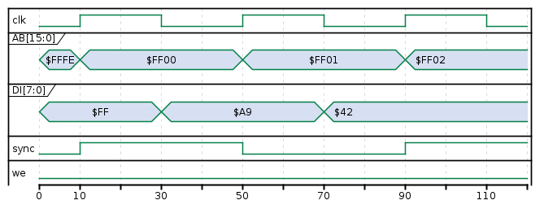
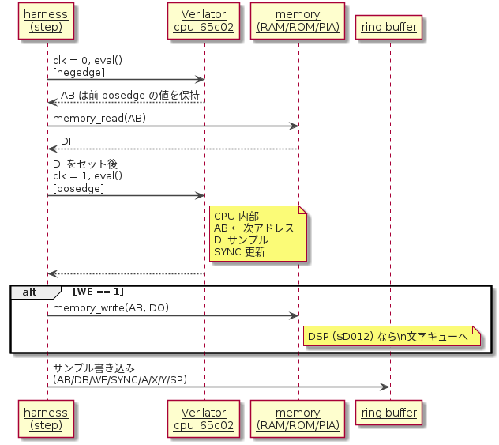

# 実装計画：04-6502 / Apple-I

## 1. 位置づけ

**CPU 第一弾。**  
本プロジェクトの固有価値「命令エミュレータでは見えない内部信号の可視化」を最初に体験させる題材。  
wozmon（Woz Monitor）を起動し、ユーザーがメモリダンプ・書き込み・実行を操作できる対話体験を実現する。

---

## 2. 到達目標（スコープ）

| Phase | 目標 | 完了条件 |
| --- | --- | --- |
| 1 | 6502 コア単体動作 | Klaus Dormann functional test が通る |
| 2 | Apple-I wozmon 起動 | ブラウザ xterm.js で `\` プロンプトが出て操作できる |
| 3 | Integer BASIC 起動 | `E000R` で BASIC が起動し `PRINT` が動く |

本計画書は **Phase 2 完了**を主ターゲットとする。

---

## 3. CPU コア：hoglet67/verilog-6502 (cpu_65c02.v)

### 3.1 採用根拠

| 項目 | arlet-65C02-microcode | **hoglet67/verilog-6502** |
| --- | --- | --- |
| ファイル数 | 7（cpu / ctl / alu / regfile / abl / abh / microcode） | **2（cpu_65c02.v + ALU.v）** |
| `$readmemb` 問題 | あり（microcode.hex → inline 化が必要） | **なし** |
| SYNC 出力 | あり | **あり** |
| DI/DO 分離 | あり | **あり** |
| AB ポート型 | 組合せ出力（`output [15:0] AD`） | **レジスタ出力（`output reg [15:0] AB`）** |
| Verilator 対応 | README に記載 | **コミット済み fix（logic → temp_logic）** |
| Dormann テスト | 通過 | **通過（README 記載 + FPGA 実機確認）** |
| ライセンス | MIT | **Attribution-only（商用可・コピーライト表示必須）** |

`$readmemb` 変換スクリプトが不要になり、実装が大幅に簡略化される。

### 3.2 リポジトリ

```text
https://github.com/hoglet67/verilog-6502
  cpu_65c02.v — 65C02 コアトップ（David Banks + Ed Spittles + Arlet Ottens）
  ALU.v       — 共有 ALU サブモジュール
  cpu.v       — NMOS 6502（今回は不使用）
  README.md
```

### 3.3 cpu_65c02.v ポートリスト

```verilog
module cpu_65c02( clk, reset, AB, DI, DO, WE, IRQ, NMI, RDY, SYNC );

input        clk;       // クロック（立上りエッジで動作）
input        reset;     // 同期リセット（High アクティブ）
output reg [15:0] AB;   // アドレスバス（レジスタ出力）
input  [7:0] DI;        // データバス入力（memory → CPU）
output [7:0] DO;        // データバス出力（CPU → memory）
output       WE;        // ライトイネーブル（High = write）
input        IRQ;       // 割り込み要求（Low アクティブ）
input        NMI;       // ノンマスカブル割り込み（Low アクティブ）
input        RDY;       // Ready（Low で一時停止）
output reg   SYNC;      // 命令フェッチ先頭サイクル（High = fetch）
```

### 3.4 メモリタイミング（AB レジスタ出力）

AB が `output reg` のため、1 クロック同期メモリモデルを採用する。

| タイミング | 処理 |
| --- | --- |
| posedge T | AB が次アドレスに更新、CPU が DI をサンプル |
| negedge T | harness が `DI ← memory[AB]` をセット |



> `LDA #$42`（$FF00: A9, $FF01: 42）2 サイクルの例。  
> posedge で AB が更新され、negedge で harness が DI を確定する。

arlet-65C02-microcode の組合せ AD 出力と異なり、AB がレジスタのため
clk=0 後に AD 確定待ちをする必要がなく、harness がシンプルになる。

```cpp
// harness での正しいメモリアクセスシーケンス
void step() {
    // 1. 立下りエッジで DI を確定（現 AB = 前サイクルで登録されたアドレス）
    top->clk = 0; top->eval();
    top->DI = memory_read(top->AB);

    // 2. 立上りエッジ（AB 更新・DI サンプル）
    top->clk = 1; top->eval();

    // 3. ライト処理（WE / DO / AB は同一 posedge で登録済み）
    if (top->WE) memory_write(top->AB, top->DO);

    // 4. ring buffer サンプリング
}
```

### 3.5 内部レジスタの露出方針

cpu_65c02.v の内部信号を `/* verilator public */` で宣言し、  
Verilator C++ API から `top->cpu_65c02->signal` でアクセスする。  
ソースに追加するのは コメント 1 行のみで、ロジック変更なし。

| 内部信号 | 型 | 露出方法 |
| --- | --- | --- |
| `A` | `[7:0]` | `/* verilator public */` 追加 |
| `X` | `[7:0]` | 同上 |
| `Y` | `[7:0]` | 同上 |
| `S` | `[7:0]` | 同上（スタックポインタ） |
| `P` または個別フラグ | `[7:0]` | 同上 |
| `state` | `[5:0]` 程度 | 同上（T-state 相当） |

> PC は `SYNC=1` のサイクルの `AB` がオペコードフェッチアドレス（PC）と等しい。  
> ただし直接露出する場合は `PC` レジスタに `/* verilator public */` を追加する。

Verilator からのアクセス例：

```cpp
#include "Vapple1_top.h"
#include "Vcpu_65c02.h"  // Verilator が生成

auto* core = top->apple1_top->u_cpu;  // 階層名は --prefix で調整
uint8_t a  = core->A;
uint8_t x  = core->X;
```

---

## 4. メモリマップ（Apple-I 準拠）

| アドレス | 内容 |
| --- | --- |
| `$0000–$0FFF` | RAM 4KB（ZP・スタック・ユーザー） |
| `$D010` | KBD データ（bit7 = ストローブ） |
| `$D011` | KBDCR（bit7=1 でキー待ち） |
| `$D012` | DSP データ（書き込みで文字出力） |
| `$D013` | DSPCR（常に `$00` = ready） |
| `$E000–$EFFF` | Integer BASIC ROM（Phase 3） |
| `$FF00–$FFFF` | Woz Monitor ROM（256 bytes） |
| `$FFFC–$FFFD` | Reset Vector = `$FF00` |

---

## 5. システム構成図


---

## 6. ファイル構成

```text
examples/04-6502/
├── verilog/
│   ├── hoglet/              ← hoglet67/verilog-6502 を git clone
│   │   ├── cpu_65c02.v      ← 内部信号に /* verilator public */ を追記
│   │   ├── ALU.v            ← 変更なし
│   │   └── README.md
│   └── apple1_top.v         ← cpu_65c02 インスタンス + アドレスデコードなし
│                               （harness 側でデコード）
├── rom/
│   ├── wozmon.bin           ← Woz Monitor バイナリ（256 bytes）
│   └── basic.bin            ← Integer BASIC（Phase 3）
├── cxx/
│   └── harness.cpp          ← RAM/ROM/PIA + ring buffer + xterm ブリッジ
└── web/
    └── index.html           ← xterm.js + Logic Analyzer + レジスタパネル

scripts/
└── build-wasm-04.sh         ← Verilator + Emscripten ビルド
```

**注意：** arlet-65C02-microcode 版と比較して `gen-microcode-inline.py` は**不要**。

---

## 7. apple1_top.v の役割

CPU インスタンスの結線のみ。アドレスデコードは harness.cpp で行うため、
トップモジュールの役割は最小限。

```verilog
module apple1_top (
    input         clk,
    input         reset,
    output [15:0] o_ab,
    input  [7:0]  i_di,
    output [7:0]  o_do,
    output        o_we,
    output        o_sync,
    input         i_irq,
    input         i_nmi,
    input         i_rdy
);
    cpu_65c02 u_cpu (
        .clk   (clk),
        .reset (reset),
        .AB    (o_ab),
        .DI    (i_di),
        .DO    (o_do),
        .WE    (o_we),
        .SYNC  (o_sync),
        .IRQ   (i_irq),
        .NMI   (i_nmi),
        .RDY   (i_rdy)
    );
endmodule
```

---

## 8. C++ harness 設計

### 8.1 メモリアクセス・PIA エミュレーション

```cpp
static uint8_t ram[0x10000];   // 64KB フラット（ROM 領域も含む）
static uint8_t kbd_data = 0;   // KBD データ（bit7=ストローブ）
static uint8_t kbd_cr   = 0;   // KBDCR（bit7=1 でキー待ち）

static uint8_t memory_read(uint16_t addr) {
    switch (addr) {
        case 0xD010: {
            uint8_t d = kbd_data; kbd_data &= 0x7F; return d;  // ストローブクリア
        }
        case 0xD011: return kbd_cr;
        case 0xD012: return 0x00;  // DSP ready
        case 0xD013: return 0x00;
        default:     return ram[addr];
    }
}

static void memory_write(uint16_t addr, uint8_t data) {
    switch (addr) {
        case 0xD012: enqueue_display(data & 0x7F); break;  // 文字出力
        default:
            if (addr < 0xD000) ram[addr] = data;  // ROM 領域は書き込まない
            break;
    }
}
```

### 8.2 1 クロックの flow（step 関数）



```cpp
EMSCRIPTEN_KEEPALIVE void step() {
    // 立下りエッジ（DI を確定）
    top->clk = 0; top->eval();
    top->i_di = memory_read(top->o_ab);

    // 立上りエッジ（AB 更新・DI サンプル・WE/DO 登録）
    top->clk = 1; top->eval();

    // ライト処理
    if (top->o_we) memory_write(top->o_ab, top->o_do);

    // ring buffer 書き込み
    write_ring();
}
```

### 8.3 ring buffer ビットレイアウト（2 uint32_t / サンプル）

```cpp
// Word 0（バスサイクル）
//   [15: 0] = AB    アドレスバス 16bit
//   [23:16] = DB    データバス 8bit（WE=1 なら DO、WE=0 なら DI）
//   [24]    = WE    ライトイネーブル
//   [25]    = SYNC  命令フェッチパルス
//   [26]    = reset
//   [31:27] = spare

// Word 1（レジスタスナップショット）
//   [ 7: 0] = A
//   [15: 8] = X
//   [23:16] = Y
//   [31:24] = SP
```

PC・フラグ・state は別 API（`get_pc()` 等）で提供する。

### 8.4 エクスポート関数

| 関数 | 役割 |
| --- | --- |
| `sim_init()` | CPU 初期化・RAM クリア・ROM ロード・reset アサート |
| `step()` | 1 クロック進める |
| `step_instruction()` | 次の SYNC まで実行（単命令ステップ、上限 20 クロック） |
| `reset_sim()` | reset アサート・head=0 |
| `send_key(uint8_t)` | キーボード入力をキューに積む |
| `get_display_char()` | 出力バッファから 1 文字取り出す（-1 = なし） |
| `get_display_count()` | 出力文字数（JS 更新トリガー） |
| `get_pc()` | PC 16bit |
| `get_a()` / `get_x()` / `get_y()` / `get_sp()` | レジスタ |
| `get_p()` | フラグ 8bit（N V - B D I Z C） |
| `get_ring_ptr()` / `get_head()` / `get_ring_size()` | ring buffer |

---

## 9. Web UI 設計

### 9.1 レイアウト


### 9.2 Logic Analyzer 信号定義

| トラック | type | 幅 | 色 | 意味 |
| --- | --- | --- | --- | --- |
| `addr` | `hex16` | 16bit | `#88ccff` / `#ff8888`（WE で色変） | アドレスバス |
| `data` | `hex` | 8bit | `#aaffaa` | データバス |
| `we` | bit | — | `#ff6644` | Write Enable |
| `sync` | bit | — | `#ffdd00` | 命令フェッチパルス |

`hex16` は新規 type（`$HHHH` 形式、4 桁 hex ラベルセグメント）。  
`we=1` のセグメントは addr/data を赤系で描き、Read/Write を視覚的に区別する。

### 9.3 xterm.js 統合

CDN（xterm.js 5.x）から読み込む。VS Code 内蔵ターミナルや GitHub Codespaces でも使用されている MIT ライセンスのブラウザ向けターミナルエミュレータ。

```html
<link rel="stylesheet" href="https://cdn.jsdelivr.net/npm/xterm/css/xterm.css" />
<script src="https://cdn.jsdelivr.net/npm/xterm/lib/xterm.js"></script>
```

```javascript
const term = new Terminal({ cols: 40, rows: 24 });
term.open(document.getElementById('terminal'));

// キーボード → 6502 へ（大文字変換 + 7-bit）
term.onData(s => {
    const code = s.toUpperCase().charCodeAt(0);
    Module._send_key(code);
});

// 6502 → 画面出力（requestAnimationFrame でポーリング）
function pollDisplay() {
    while (Module._get_display_count() > 0) {
        const ch = Module._get_display_char();
        if (ch === 0x0D) term.write('\r\n');   // CR → CRLF
        else term.write(String.fromCharCode(ch));
    }
    requestAnimationFrame(pollDisplay);
}
```

#### 9.3.1 Apple-I 固有の注意点

| 事項 | 内容 |
| --- | --- |
| 文字コード | 7-bit ASCII 大文字のみ（bit7 はストローブフラグ） |
| 入力変換 | `toUpperCase()` + `charCodeAt(0)` で 7-bit に収める |
| 改行 | Apple-I は CR（`$0D`）のみ出力。xterm は `\r\n` を期待するため `\r` → `\r\n` 変換 |
| バックスペース | Apple-I は `_`（`$DF`）を BS として使う。xterm では `\b \b` で文字を消す |

#### 9.3.2 Web Worker との通信（SharedArrayBuffer なし環境）

```text
[Web Worker]                    [Main Thread]
  step() ループ  → postMessage({type:'char', ch}) → term.write()
                ← postMessage({type:'key',  code}) ← term.onData()
```

SharedArrayBuffer が利用可能な環境ではリングバッファを共有してゼロコピーにできる。

---

## 10. ビルドスクリプト（build-wasm-04.sh）

```bash
HOGLET="$EXAMPLE/verilog/hoglet"

verilator --cc \
    "$EXAMPLE/verilog/apple1_top.v" \
    "$HOGLET/cpu_65c02.v" \
    "$HOGLET/ALU.v" \
    --top-module apple1_top \
    --Mdir "$OBJ_DIR"
```

EXPORTED_FUNCTIONS に `_send_key`, `_get_display_char`, `_get_display_count`,  
`_get_pc`, `_get_a`, `_get_x`, `_get_y`, `_get_sp`, `_get_p`,  
`_step_instruction` を追加する。

---

## 11. 実装ステップ

| # | 作業 | 完了条件 |
| --- | --- | --- |
| 1 | `git clone hoglet67/verilog-6502` を `verilog/hoglet/` に配置 | ファイル 4 本確認 |
| 2 | `cpu_65c02.v` 内の A/X/Y/S/state 等に `/* verilator public */` 追記 | lint 通過 |
| 3 | `apple1_top.v` 作成（cpu_65c02 インスタンス + ポート引き出し） | lint 通過 |
| 4 | `harness.cpp` — RAM/ROM/PIA エミュ・ring buffer（2 ワード） | em++ ビルド成功 |
| 5 | wozmon.bin を `uint8_t[]` で組み込み、Reset Vector 確認 | reset 後 AB=$FFFC が見える |
| 6 | `build-wasm-04.sh` | `sim.js` + `sim.wasm` 生成 |
| 7 | xterm.js 文字出力 | ブラウザに `\` プロンプトが表示される |
| 8 | キーボード入力 | `FFFF.` でメモリダンプできる |
| 9 | Logic Analyzer（hex16 type） | addr/data バスサイクルが見える |
| 10 | Register Panel（PC/A/X/Y/SP/flags） | リアルタイム更新 |
| 11 | Step 機能 | 1 命令ずつ実行できる |
| 12 | Integer BASIC ROM 組み込み（Phase 3） | `E000R` で BASIC 起動 |

---

## 12. 技術的課題・注意点

### 12.1 AB の 1 サイクル遅延

AB が `output reg` のため、harness で `DI = memory_read(top->AB)` したデータは
AB を登録した posedge の**次の** posedge で CPU に届く。  
6502 の実動作（アドレス出力→データバス安定→次サイクルラッチ）と一致するため正しい。

### 12.2 WE / DO の有効タイミング

WE が High の posedge に AB・DO が同時に登録される。  
`clk=1 → eval()` 後に `top->WE` を確認してライト処理すれば正しい。

### 12.3 `/* verilator public */` の適用

Verilator は public アノテート信号を `top->u_cpu->signal_name` でアクセス可能にする。  
適用対象の正確な名前は `cpu_65c02.v` を開いて確認し、Step 2 で追記する。

### 12.4 SYNC によるオペコード取得

```cpp
// harness.cpp 内（step() の posedge 後）
if (top->o_sync) {
    last_opcode = top->o_do;  // SYNC サイクルでは DO ではなく DI が正しい
    // 厳密には DI（memory_read 済みの値）を保存する
}
```

### 12.5 step_instruction() の安全上限

65C02 最長命令は 7 サイクル。無限ループ防止のため上限を 20 とする。

```cpp
EMSCRIPTEN_KEEPALIVE void step_instruction() {
    int guard = 0;
    do { step(); } while (!top->o_sync && ++guard < 20);
}
```

### 12.6 Verilator 警告への対処

`casex` 使用による警告は `-Wno-CASEX` で抑制。  
`1'bx` 代入は `--x-assign fast` で対応する。

---

## 13. PlantUML 図

| ファイル | 内容 | 挿入箇所 |
| --- | --- | --- |
| [`04-apple1-arch.puml`](../img/04-apple1-arch.puml) | システム構成図（RTL / Harness / Web レイヤ） | ファイル構成の前 |
| [`04-ab-bus-timing.puml`](../img/04-ab-bus-timing.puml) | `LDA #$42` の ABバスタイミング（AB reg 出力） | メモリタイミング節 |
| [`04-step-sequence.puml`](../img/04-step-sequence.puml) | `step()` 1 クロックのシーケンス | C++ harness 節 |
| [`04-apple1-ui.puml`](../img/04-apple1-ui.puml) | Web UI ワイヤーフレーム（Salt） | Web UI 設計節 |

PNG の再生成：

```bash
plantuml doc/img/04-*.puml
```
