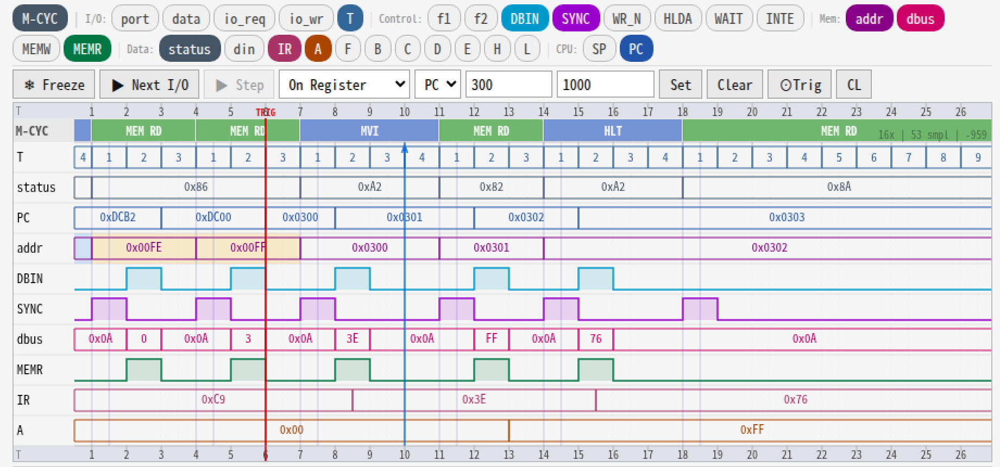

# 59. 8080 ステータスバイトとバスアーキテクチャ比較

## 1. 8080 のステータスバイトとは

Intel 8080 は、各マシンサイクルの **T1（SYNC=1 期間）** に  
データバス (D7–D0) へ **ステータスバイト** を出力する。

```text
T1: CPU → dbus にステータスバイトを出力 (SYNC=1)
T2: メモリ/IO → dbus にデータを出力 (DBIN=1)
T3: データ安定、CPU がラッチ
T4: 内部デコード（命令フェッチのみ）
```

### 1.1 ステータスバイトのビット定義

| ビット | 信号名 | 意味 |
|--------|--------|------|
| D7 | MEMR | メモリリードサイクル |
| D6 | INP | I/O 入力サイクル (IN 命令) |
| D5 | M1 | 命令フェッチ（第1マシンサイクル）|
| D4 | OUT | I/O 出力サイクル (OUT 命令) |
| D3 | HLTA | HLT 命令受付済み |
| D2 | STACK | スタックアクセス |
| D1 | WO | 書き込みでない (= !WR) |
| D0 | INTA | 割り込み応答サイクル |

### 1.2 主なサイクルのステータスバイト値

| サイクル種別 | 値 | 備考 |
|-------------|-----|------|
| 命令フェッチ (M1) | 0xA2 | MEMR+M1+WO |
| メモリリード (M2以降) | 0x82 | MEMR+WO |
| スタックリード | 0x86 | MEMR+STACK+WO |
| スタックライト | 0x04 | STACK のみ |
| I/O 入力 | 0x42 | INP+WO |
| I/O 出力 | 0x10 | OUT のみ |
| 割り込み応答 | 0x23 | M1+WO+INTA |
| HALT | 0x8A | MEMR+HLTA+WO |

> **vm80a での観測値について**  
> Logic Analyzer の dbus フィールドはハーネスのキャプチャタイミングにより  
> 0x0A などの値が見えることがある。  
> `status_byte` (Word 4[7:0]) が正式なステータスバイト値。

### 1.3 vm80a Logic Analyzer での観測例



上の波形は `RET (0xC9)` → `MVI A, 0xFF (0x3E 0xFF)` → `HLT (0x76)` のシーケンスを
Logic Analyzer でキャプチャしたもの（PC=0x0300 でトリガー）。

各サイクルのステータスバイト（`status` 行 = Word 4[7:0]）と
外部データバス（`dbus` 行 = Word 3[31:24]）の対応：

| M-CYC | T-state | status (Word 4) | dbus | 説明 |
|-------|---------|-----------------|------|------|
| MEM RD (RET M2) | T1 | 0x86 | 0x0A | スタックリード、T1：CPUがバスを保持 |
| MEM RD (RET M2) | T2–T3 | 0x86 | 0x00 | DBIN=1、メモリが 0x00FE の内容を出力 |
| MEM RD (RET M3) | T1 | 0x86 | 0x0A | スタックリード、T1 |
| MEM RD (RET M3) | T2–T3 | 0x86 | 0x03 | DBIN=1、メモリが 0x00FF の内容 (0x03) を出力 |
| MVI (M1 フェッチ) | T1 | 0xA2 | 0x0A | 命令フェッチ、T1 |
| MVI (M1 フェッチ) | T2–T3 | 0xA2 | 0x3E | DBIN=1、メモリが MVI A オペコードを出力 |
| MEM RD (MVI M2) | T2–T3 | 0x82 | 0xFF | DBIN=1、即値 0xFF を読み出し |
| HLT (M1 フェッチ) | T1 | 0xA2 | 0x0A | HLT 命令フェッチ |
| HLT (M1 フェッチ) | T2–T3 | 0xA2 | 0x76 | DBIN=1、0x76 (HLT) を読み出し |
| HLT (実行中) | — | 0x8A | 0x0A | HALT サイクル（HLTA=1）、バスはアイドル |

**ポイント：**

- `status` 行が Intel 仕様どおり 0x86 / 0xA2 / 0x82 / 0x8A を正しく示している
- `dbus` 行は T1（SYNC=1、DBIN=0）では **0x0A** を示す
  → これは CPU の io_dout がドライブする値であり、ステータスバイトそのものではない
  → 正式なステータスバイトは必ず `status` 行（Word 4[7:0]）を参照すること
- T2–T3（DBIN=1）ではメモリが実データを出力し、dbus にオペコード・即値が現れる
- SYNC と DBIN の波形が交互にアサートされることで「T1 = ステータス期間」
  「T2–T3 = データ期間」が明確に読み取れる

---

## 2. なぜデータバスをステータス出力に使うのか

8080（1974年）は 40 ピン DIP パッケージ。  
アドレスバス 16 本＋データバス 8 本だけでピンがほぼ満杯。  
**専用のステータス出力ピンを設ける余裕がなかった**ため、  
T1 の短い期間だけデータバスをステータス通知に流用した。

実システムでは **Intel 8228 Bus Controller** がこのステータスバイトを  
SYNC パルスに同期してラッチし、MEMR/IOR/IOW/WR 等の制御信号を生成した。

---

## 3. Z80 との比較

Z80（1976年、8080 の後継互換設計）は  
ステータスバイトをデータバスに出力する仕組みを**廃止した**。

### 3.1 Z80 のバス制御信号（専用ピン）

| 信号 | 方向 | 意味 |
|------|------|------|
| /MREQ | 出力 | メモリアクセス要求 |
| /IORQ | 出力 | I/O アクセス要求 |
| /RD | 出力 | 読み出し |
| /WR | 出力 | 書き込み |
| /M1 | 出力 | 命令フェッチサイクル (第1バイト) |
| /RFSH | 出力 | DRAMリフレッシュサイクル |

8080 でステータスバイトで表現していた情報をそれぞれ**独立した専用ピン**に分離。  
外部に 8228 相当のラッチ IC が不要になり、直接メモリや周辺 IC に接続できる。

### 3.2 Z80 のマシンサイクル M1（命令フェッチ）

```text
T1: /MREQ↓, /RD↓, /M1↓  → アドレス確定と同時に制御信号を出す
T2: データバスにオペコードが現れる
T3: CPU がデータをラッチ、/MREQ↑, /RD↑
T4: 内部デコード（/M1↑）
```

データバスはずっと「データ専用」で、ステータス情報は一切乗らない。

---

## 4. 他の CPU との比較まとめ

| CPU | 年 | ステータスバイト方式 | バス方式 |
|-----|----|--------------------|---------|
| Intel 8008 | 1972 | あり（S0–S2 状態線） | 多重バス（8080 の先祖） |
| **Intel 8080** | **1974** | **あり（D7–D0 に乗る）** | **SYNC 多重バス** |
| Zilog Z80 | 1976 | **なし** | 専用制御信号ピン |
| Intel 8085 | 1976 | 部分的あり (ALE/S0–S1) | AD7–AD0 アドレス多重 |
| MOS 6502 | 1975 | **なし** | R/W ピン 1 本のみ |
| Motorola 6800 | 1974 | **なし** | R/W ピン + VMA |
| Motorola 68000 | 1979 | なし (FC0–FC2 機能コード) | 非多重、専用バス |

### 4.1 Intel 8085 の場合

8085 は 8080 の改良版だが、別の多重化を採用：

- **AD7–AD0**：アドレス下位 8 ビット と データバスを**時分割共有**（T1 でアドレス、T2 でデータ）
- **ALE（Address Latch Enable）**：T1 でアドレスをラッチするタイミング信号
- **S1/S0**：バスサイクル種別（00=HLT, 01=WRITE, 10=READ, 11=FETCH）
- SYNC によるデータバスへのステータスバイト出力は**廃止**

### 4.2 MOS 6502 の場合

6502 はシンプルの極致：

- **R/W̄ ピン 1 本**：High = Read、Low = Write
- ステータスバイト一切なし
- アドレスバスとデータバスは完全に分離（多重なし）
- 全 T-state でアドレスバスは有効（PHI2=High でメモリが応答）

```text
PHI1: アドレス確定
PHI2: R/W に応じてデータ転送
    → 毎サイクル必ずメモリアクセスが発生する（ダミーリードあり）
```

---

## 5. ステータスバイト方式の評価

### メリット

- ピン数を節約できる（40ピン DIP 時代の制約に対応）
- サイクル種別の情報量が豊富（8ビット全部使える）

### デメリット

- 外部に必ずラッチ IC（8228/8212 等）が必要
- ステータスバイトが有効なのは T1 の一瞬だけ → タイミング設計が難しい
- デバッグ時に「dbus がデータなのかステータスなのか」が分かりにくい
  → **Logic Analyzer で dbus を見るとき T-state を確認する必要がある**（本プロジェクトでも観測）

---

## 6. まとめ

> **8080 のステータスバイトはデータバス多重化の産物**であり、  
> Z80 以降の世代では専用制御信号ピンへの分離が主流になった。  
> 6502 のような「シンプルに R/W 1 本」という方向性も並行して発展した。
>
> vm80a シミュレータの Logic Analyzer で `dbus=0x0A → 0x3E → 0x0A` と  
> 見える現象は、この T1 ステータスバイト→T2-T3 命令コード→T4 開放という  
> 8080 バスプロトコルをそのまま可視化したものである。
