# 24. 全命令タイミング図 — ケース別解説

[22-全命令タイミング図.md](22-全命令タイミング図.md) がタイミング図の読み方全般（T軸・istate・カテゴリ別パターン）を
扱うのに対し、本ドキュメントは 61 ケース各々の**設計意図・数値の根拠・観測ポイント**を記す。

---

## 目次

- [凡例](#凡例)
- [1. Phase A — No operand（1件）](#1-phase-a--no-operand1件)
  - [1.1 ケース 00 — NOP](#11-ケース-00--nop)
- [2. Phase B — Single-operand register（9件）](#2-phase-b--single-operand-register9件)
  - [2.1 ケース 01 — CLR R1](#21-ケース-01--clr-r1)
  - [2.2 ケース 02 — COM R1](#22-ケース-02--com-r1)
  - [2.3 ケース 03 — INC R1](#23-ケース-03--inc-r1)
  - [2.4 ケース 04 — DEC R1](#24-ケース-04--dec-r1)
  - [2.5 ケース 05 — NEG R1](#25-ケース-05--neg-r1)
  - [2.6 ケース 06 — ADC R1（C=0）](#26-ケース-06--adc-r1c0)
  - [2.7 ケース 07 — SBC R1（C=0）](#27-ケース-07--sbc-r1c0)
  - [2.8 ケース 08 — TST R1](#28-ケース-08--tst-r1)
  - [2.9 ケース 09 — SXT R1（N=1）](#29-ケース-09--sxt-r1n1)
- [3. Phase C — Shift/Rotate register（6件）](#3-phase-c--shiftrotate-register6件)
  - [3.1 ケース 10 — ROR R1（C=0）](#31-ケース-10--ror-r1c0)
  - [3.2 ケース 11 — ROL R1（C=0）](#32-ケース-11--rol-r1c0)
  - [3.3 ケース 12 — ASR R1](#33-ケース-12--asr-r1)
  - [3.4 ケース 13 — ASL R1](#34-ケース-13--asl-r1)
  - [3.5 ケース 14 — SWAB R1](#35-ケース-14--swab-r1)
  - [3.6 ケース 15 — SXT R1（N=0 バリアント）](#36-ケース-15--sxt-r1n0-バリアント)
- [4. Phase D — Double-operand register-register（7件）](#4-phase-d--double-operand-register-register7件)
  - [4.1 ケース 16 — MOV R0, R1](#41-ケース-16--mov-r0-r1)
  - [4.2 ケース 17 — CMP R0, R1（Z=1）](#42-ケース-17--cmp-r0-r1z1)
  - [4.3 ケース 18 — BIT R0, R1](#43-ケース-18--bit-r0-r1)
  - [4.4 ケース 19 — BIC R0, R1](#44-ケース-19--bic-r0-r1)
  - [4.5 ケース 20 — BIS R0, R1](#45-ケース-20--bis-r0-r1)
  - [4.6 ケース 21 — ADD R0, R1](#46-ケース-21--add-r0-r1)
  - [4.7 ケース 22 — SUB R0, R1](#47-ケース-22--sub-r0-r1)
- [5. Phase E — 即値オペランド（4件）](#5-phase-e--即値オペランド4件)
  - [5.1 ケース 23 — MOV #5, R1（即値転送）](#51-ケース-23--mov-5-r1即値転送)
  - [5.2 ケース 24 — ADD #3, R1（即値加算）](#52-ケース-24--add-3-r1即値加算)
  - [5.3 ケース 25 — CMP #5, R1（即値比較、Z=1）](#53-ケース-25--cmp-5-r1即値比較z1)
  - [5.4 ケース 26 — BIS #017, R1（即値ビットセット）](#54-ケース-26--bis-017-r1即値ビットセット)
- [6. Phase F — メモリアクセス（6件）](#6-phase-f--メモリアクセス6件)
  - [6.1 ケース 27 — MOV (R1), R2（間接ロード）](#61-ケース-27--mov-r1-r2間接ロード)
  - [6.2 ケース 28 — MOV R2, (R1)（間接ストア）](#62-ケース-28--mov-r2-r1間接ストア)
  - [6.3 ケース 29 — MOV (R1)+, R2（後置インクリメント）](#63-ケース-29--mov-r1-r2後置インクリメント)
  - [6.4 ケース 30 — MOV -(R1), R2（前置デクリメント）](#64-ケース-30--mov--r1-r2前置デクリメント)
  - [6.5 ケース 31 — MOV 2(R1), R2（インデックスアドレッシング）](#65-ケース-31--mov-2r1-r2インデックスアドレッシング)
  - [6.6 ケース 32 — MOVB (R1), R2（バイトロード・符号拡張）](#66-ケース-32--movb-r1-r2バイトロード符号拡張)
- [7. Phase G — 分岐命令（8件）](#7-phase-g--分岐命令8件)
  - [7.1 ケース 33 — BR（無条件分岐・取得）](#71-ケース-33--br無条件分岐取得)
  - [7.2 ケース 34 — BNE 取得（Z=0）](#72-ケース-34--bne-取得z0)
  - [7.3 ケース 35 — BNE 非取得（Z=1）](#73-ケース-35--bne-非取得z1)
  - [7.4 ケース 36 — BEQ 取得（Z=1）](#74-ケース-36--beq-取得z1)
  - [7.5 ケース 37 — BGE 取得（N=V=0）](#75-ケース-37--bge-取得nv0)
  - [7.6 ケース 38 — BLT 取得（N=1, V=0）](#76-ケース-38--blt-取得n1-v0)
  - [7.7 ケース 39 — BCC 取得（C=0）](#77-ケース-39--bcc-取得c0)
  - [7.8 ケース 40 — BCS 取得（C=1）](#78-ケース-40--bcs-取得c1)
- [8. Phase H — JSR/RTS（2件）](#8-phase-h--jsrrts2件)
  - [8.1 ケース 41 — JSR R5, sub](#81-ケース-41--jsr-r5-sub)
  - [8.2 ケース 42 — RTS R5](#82-ケース-42--rts-r5)
  - [8.3 設計メモ — JSR Rx の哲学と現代的評価](#83-設計メモ--jsr-rx-の哲学と現代的評価)
- [9. Phase I — JMP, SOB（3件）](#9-phase-i--jmp-sob3件)
  - [9.1 ケース 43 — JMP (R1)（間接ジャンプ）](#91-ケース-43--jmp-r1間接ジャンプ)
  - [9.2 ケース 44 — SOB 取得（R1=2→1）](#92-ケース-44--sob-取得r121)
  - [9.3 ケース 45 — SOB 非取得（R1=1→0）](#93-ケース-45--sob-非取得r110)
- [10. Phase J — バイト命令（4件）](#10-phase-j--バイト命令4件)
  - [10.1 ケース 46 — MOVB R0, R1（バイト転送・符号拡張）](#101-ケース-46--movb-r0-r1バイト転送符号拡張)
  - [10.2 ケース 47 — CLRB R1（下位バイトクリア）](#102-ケース-47--clrb-r1下位バイトクリア)
  - [10.3 ケース 48 — INCB R1（下位バイトインクリメント）](#103-ケース-48--incb-r1下位バイトインクリメント)
  - [10.4 ケース 49 — CMPB R0, R1（バイト比較、Z=1）](#104-ケース-49--cmpb-r0-r1バイト比較z1)
- [11. Phase K — アドレッシングモード展示（5件）](#11-phase-k--アドレッシングモード展示5件)
  - [11.1 ケース 50 — Mode 0: MOV R0, R1（レジスタ直接）](#111-ケース-50--mode-0-mov-r0-r1レジスタ直接)
  - [11.2 ケース 51 — Mode 1: MOV (R0), R1（レジスタ間接）](#112-ケース-51--mode-1-mov-r0-r1レジスタ間接)
  - [11.3 ケース 52 — Mode 2: MOV (R0)+, R1（後置オートインクリメント）](#113-ケース-52--mode-2-mov-r0-r1後置オートインクリメント)
  - [11.4 ケース 53 — Mode 4: MOV -(R0), R1（前置オートデクリメント）](#114-ケース-53--mode-4-mov--r0-r1前置オートデクリメント)
  - [11.5 ケース 54 — Mode 6: MOV 2(R0), R1（インデックスアドレッシング）](#115-ケース-54--mode-6-mov-2r0-r1インデックスアドレッシング)
- [12. Phase N — EIS 命令（6件）](#12-phase-n--eis-命令6件)
  - [12.1 ケース 55 — MUL R1, R0（16×16 乗算）](#121-ケース-55--mul-r1-r01616-乗算)
  - [12.2 ケース 56 — DIV R2, R0（32÷16 除算）](#122-ケース-56--div-r2-r03216-除算)
  - [12.3 ケース 57 — ASH #3, R0（左シフト 3）](#123-ケース-57--ash-3-r0左シフト-3)
  - [12.4 ケース 58 — ASH #-2, R0（右シフト 2）](#124-ケース-58--ash--2-r0右シフト-2)
  - [12.5 ケース 59 — ASHC #4, R0（32bit 左シフト 4）](#125-ケース-59--ashc-4-r032bit-左シフト-4)
  - [12.6 ケース 60 — DIV ゼロ除算（V=1 abort）](#126-ケース-60--div-ゼロ除算v1-abort)
- [13. 参考](#13-参考)

---

## 凡例

### 数値表記

| 表記 | 意味 |
|------|------|
| `0o1000` | 8進数。PDP-11 はアドレス・命令語・レジスタ値をすべて8進で扱う |
| `177777` | `0o` を省略した8進数（アセンブラ・タイミング図の表示と同じ形式） |
| `#n` | 即値オペランド（例: `MOV #5, R1` の `5`） |

### T 軸・トリガー

| 表記 | 意味 |
|------|------|
| T=0 | トリガー点。観測対象命令の命令フェッチ（M1）が発生した瞬間 |
| T<0 | プリトリガー期間。トリガー前の履歴波形（直前命令が見える） |
| T>0 | ポストトリガー期間。トリガー後の波形 |
| nT | n クロック分の実行時間（例: `5T` = 5 クロック） |

### istate — マイクロシーケンサ状態

| シンボル | 読み | 意味 |
|----------|------|------|
| `f1` | fetch | 命令フェッチ。PC のアドレスからオペコードを読む |
| `c1` | decode | 命令デコード。オペコードを解釈してシーケンスを決定 |
| `s1`〜`s4` | source | ソースオペランド計算（アドレス計算・メモリ読み出し） |
| `d1`〜`d4` | dest | デスティネーションオペランド計算 |
| `e1` | execute | ALU 演算（加算・比較・シフトなど） |
| `w1` | writeback | 演算結果をレジスタへ書き戻す |
| `p1` | push | スタックへプッシュ（JSR で旧 Rn を退避） |
| `o1` | pop | スタックからポップ（RTS で旧 Rn を復元） |

### PSW — プログラムステータスワード

| フラグ | 意味 |
|--------|------|
| N | Negative — 演算結果が負（bit15=1）のとき 1 |
| Z | Zero — 演算結果がゼロのとき 1 |
| V | oVerflow — 符号ありオーバーフローのとき 1 |
| C | Carry — キャリー（桁上がり）が発生したとき 1 |

### アドレッシングモード

| 記法 | モード番号 | 動作 |
|------|-----------|------|
| `Rn` | 0 | レジスタ直接 — Rn の値を使用 |
| `(Rn)` | 1 | レジスタ間接 — M[Rn] を参照 |
| `(Rn)+` | 2 | 後置オートインクリメント — M[Rn]、その後 Rn += 2 |
| `-(Rn)` | 4 | 前置オートデクリメント — Rn -= 2、その後 M[Rn] |
| `X(Rn)` | 6 | インデックス — M[Rn + X]（X は後続ワード） |
| `#n` | 2(PC) | 即値 — 命令ストリームから値を取得（`(PC)+` の特殊形） |

### レジスタ別名

| 名前 | 意味 |
|------|------|
| SP | Stack Pointer — R6 の別名 |
| PC | Program Counter — R7 の別名。分岐・JSR/RTS で暗黙的に使われる |

### バスサイクル用語

| 用語 | 意味 |
|------|------|
| FETCH | 命令オペコードのバス読み出し（M1 サイクル） |
| MEM_RD | データ読み出しバスサイクル（FETCH 以外） |
| MEM_WR | データ書き込みバスサイクル |

### その他の記法

| 記法 | 意味 |
|------|------|
| `A→B` | 値が A から B に変化（例: `R1: 177777→0`） |
| `M[addr]` | アドレス `addr` のメモリ内容 |
| `0o1004` の `CLR R1` | アドレス `0o1004` に配置された命令 `CLR R1` |

---

## 1. Phase A — No operand（1件）

### 1.1 ケース 00 — NOP

<details><summary>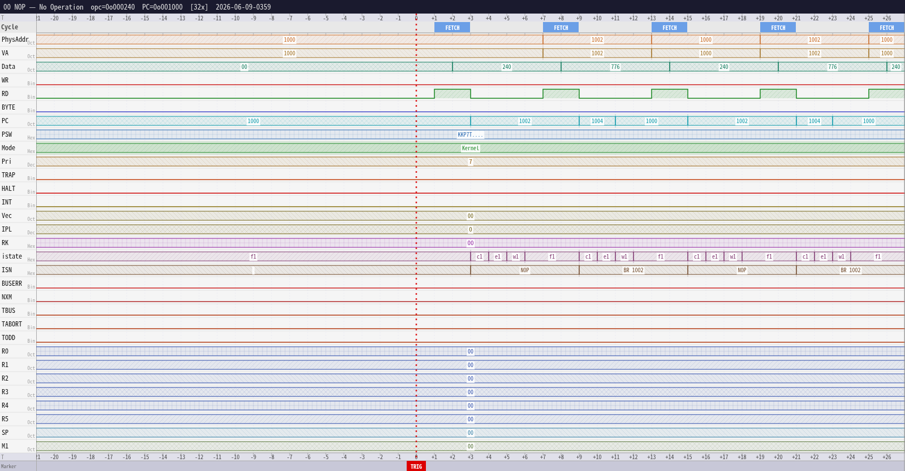</summary>


</details>

`NOP` は PDP-11 の「何もしない」命令（オペコード `0o000240`）。
アドレス `0o1000` に単独で配置し、その後に自己ループ `br 1b` を続ける。
zoom=32 の広域表示で istate が `f1→c1→e1` の **3T 最小パターン**を確認するのが目的。

観測ポイントはバスアクセスが命令フェッチ 1 回のみである点と、`e1` でフラグ更新が
発生しないことである。PC がフェッチ後に `+2` されるが、レジスタへの書き戻し（`w1`）は
現れない。プリトリガー期間（T<0）には直前ループの BR が見え、FETCH サイクルが交互に
現れる。

---

## 2. Phase B — Single-operand register（9件）

### 2.1 ケース 01 — CLR R1

<details><summary></summary>


</details>

`CLR R1` はデスティネーションレジスタを 0 にし、PSW を `N=0, Z=1, V=0, C=0` にセット
する命令。プリトリガー期間に `MOV $177777, R1`（2 ワード = 4 バイト、アドレス `0o1000`〜`0o1003`）
で R1 に全ビット 1 を書き込んでから、`0o1004` の `CLR R1` をトリガーする。この初期値により、
「R1 が確実に 0 以外からスタートする」ことが保証される。

観測ポイントは istate `f1→c1→d1→e1→w1` の **5T パターン**と、R1 の値が `177777` から
`0` へ変化するタイミング（`w1` クロック）。PSW の Z フラグが `1` に変わることも `e1` で確認できる。
バスアクセスはフェッチ 1 回のみ（MEM_RD/MEM_WR なし）。

### 2.2 ケース 02 — COM R1

<details><summary>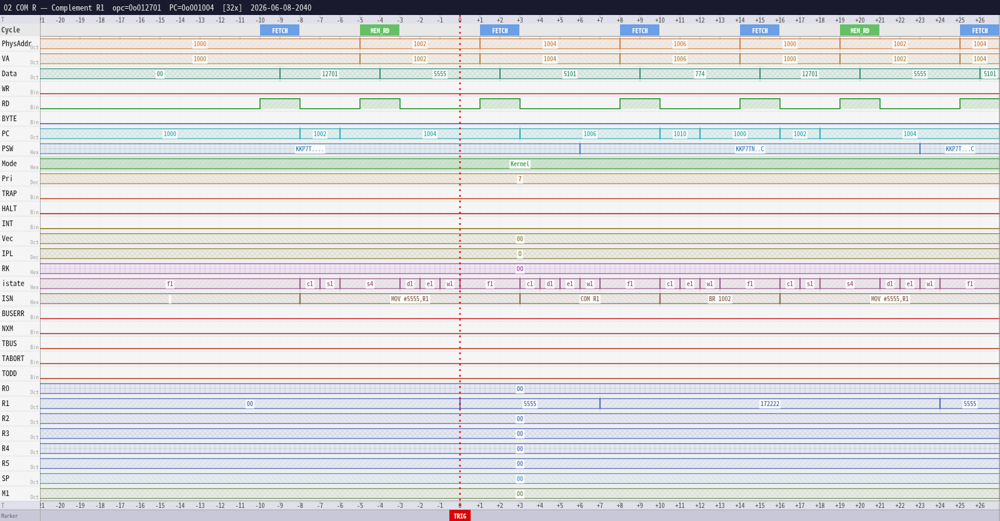</summary>


</details>

`COM R1` はビット反転命令（1 の補数）。`MOV $5555, R1`（オクタル）で初期値を設定し、
`0o1004` で `COM R1` を実行する。`0o5555` の全ビット反転が `0o172222` になることを確認する。

観測ポイントは istate `f1→c1→d1→e1→w1`（5T）と、`e1` での ALU 反転演算。
PSW では `N=1, Z=0, V=0, C=0` が設定される（`0o172222` は負数）。
プリトリガー期間に `MOV #5555,R1` の FETCH×2 が見える。

### 2.3 ケース 03 — INC R1

<details><summary>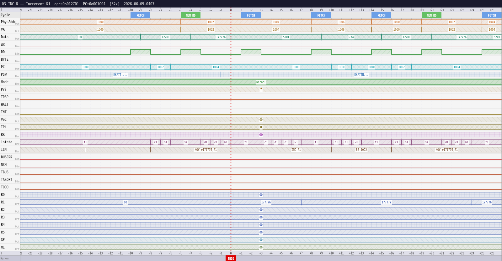</summary>


</details>

`INC R1` は 1 加算命令。`MOV $177776, R1` でオーバーフロー境界値を設定してから
`0o1004` で `INC R1` を実行する。`0o177776 + 1 = 0o177777`（最大正値の境界）。

観測ポイントは R1 が `177776`→`177777` に変化するタイミング（`w1`）と
PSW の V フラグ（`177776` から `177777` への増分は符号なし最大値のため V=0、
さらに `177777 + 1` なら V=1 が発生するがこのケースは V=0）。
istate は 5T（`f1→c1→d1→e1→w1`）。

### 2.4 ケース 04 — DEC R1

<details><summary>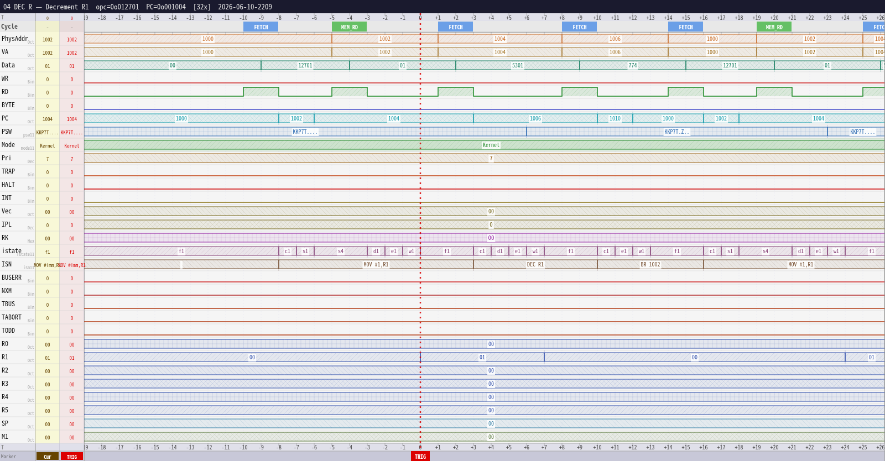</summary>


</details>

`DEC R1` は 1 減算命令。`MOV $1, R1` で最小正値から開始し、`0o1004` で `DEC R1` を実行する。
`0o1 - 1 = 0`（Z=1 が立つ境界値）。

観測ポイントは R1 が `1`→`0` に変化するタイミングと Z フラグの立ち上がり。
`0o100000`（最小負数）を DEC すると V=1 オーバーフローが起きるが、
本ケースでは V=0 の通常減算パターンを示す。istate は 5T。

### 2.5 ケース 05 — NEG R1

<details><summary>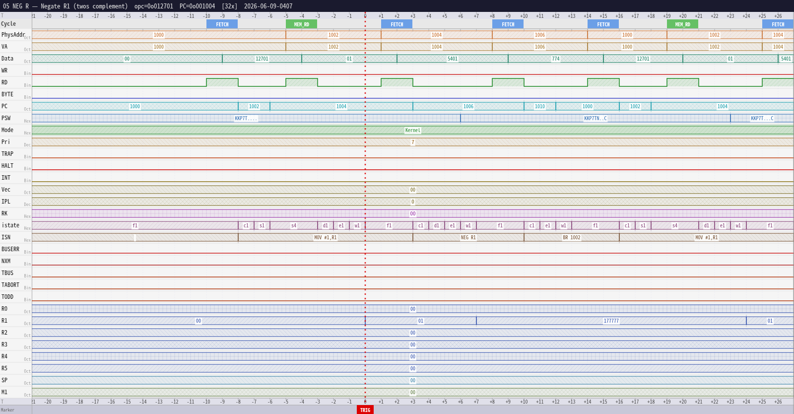</summary>


</details>

`NEG R1` は 2 の補数否定命令（`R1 ← 0 - R1`）。`MOV $1, R1` で初期値 1 を与え、
`0o1004` で `NEG R1` を実行する。結果は `0o177777`（= -1 の 2 の補数表現）。

観測ポイントは R1 が `1`→`177777` へ変化するタイミングと、
N フラグが 1 に立つこと（`0o177777` は負数）。ゼロに対する NEG は 0 のままで
C=0、それ以外は C=1 が立つ PDP-11 の仕様を頭に置いて PSW を観察するとよい。
istate は 5T。

### 2.6 ケース 06 — ADC R1（C=0）

<details><summary></summary>


</details>

`ADC R1` はキャリーフラグを加算する命令。プリトリガー期間の `MOV $777, R1` で
初期値を設定する。なお、直前命令がキャリーを変更しないため C=0 の状態で
`ADC R1` が実行される（C=0 なら加算は `R1 + 0 = R1` で不変）。

観測ポイントは「C=0 のとき ADC が事実上 NOP と同等」であること——
R1 の値は変わらず、PSW の N/Z が `0o777` に基づいて設定されるだけとなる。
C=1 のバリアントと比較するには BCS ケースと組み合わせた実験が有効。
istate は 5T。

### 2.7 ケース 07 — SBC R1（C=0）

<details><summary>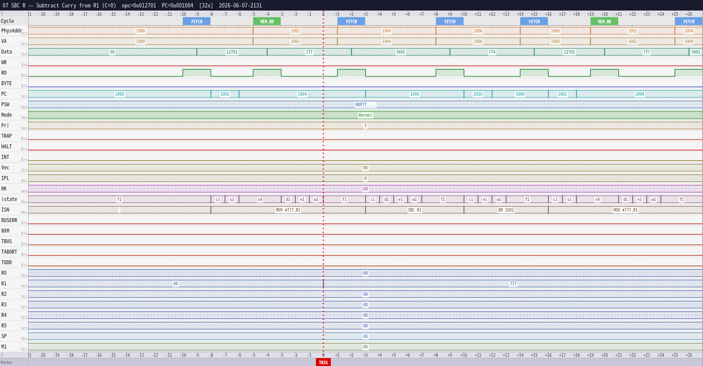</summary>


</details>

`SBC R1` はキャリーフラグを減算する命令。`MOV $777, R1` で初期値を設定し、
C=0 の状態で実行する（C=0 なら `R1 - 0 = R1` で不変）。

観測ポイントは ADC と対称的に「C=0 なら実質 NOP」となる動作。
PSW は `0o777` の値に基づき N=0, Z=0 になる。
ADC/SBC はキャリー連鎖の多倍長演算で使われる命令であり、
両ケースを並べると C フラグが連鎖路として機能する設計が明確になる。
istate は 5T。

### 2.8 ケース 08 — TST R1

<details><summary></summary>


</details>

`TST R1` は「テスト」命令——R1 の値を読むが変更せず、PSW の N/Z フラグだけを
更新する。`MOV $5555, R1` で `0o5555` を設定し、`0o1004` で `TST R1` を実行する。

観測ポイントはレジスタが変化しないにもかかわらず PSW が更新される点。
istate 列は `f1→c1→d1→e1` の **4T** で `w1` が出ない——
ALU 結果を書き戻さないため。`0o5555` は正数（N=0, Z=0）。
V=0, C=0 に強制リセットされる（PDP-11 仕様）。

### 2.9 ケース 09 — SXT R1（N=1）

<details><summary>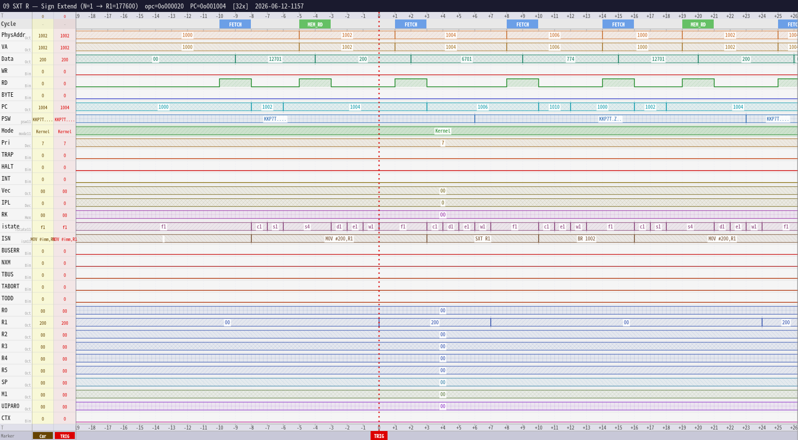</summary>


</details>

`SXT R1` は「符号拡張」命令——PSW の N フラグを 16 ビット全体に広げ、
N=1 なら `R1 ← 0o177777`（全 1）、N=0 なら `R1 ← 0` にする。
`MOV $200, R1` で上位バイトが 0 の値を書き込み、その後 N=1 が PSW にある状態で
（`0o200` は正数なので N=0 になるため、MOV 自体の PSW 更新では N=0 になる点に注意——
実際にはプリトリガーループの繰り返しにより N フラグの状態を利用）、
`0o1004` で `SXT R1` を実行する。

> **注記**: `SXT` を実行する直前の N フラグは、プリトリガーループ最後の
> `MOV $200, R1` が設定した PSW に依存する。`0o200` = 128 (10進) は正数なので N=0 となり、
> Phase C の `sxt-r-n0`（ケース 15）と同じ結果になる可能性がある。
> スクリーンショットで実際の R1 の変化値を確認すること。

観測ポイントは R1 が `200`→`177777` または `200`→`0` に変化するタイミングと、
SXT が「PSW の N ビットを読んで実行結果を決める」という PDP-11 固有の動作。

---

## 3. Phase C — Shift/Rotate register（6件）

### 3.1 ケース 10 — ROR R1（C=0）

<details><summary>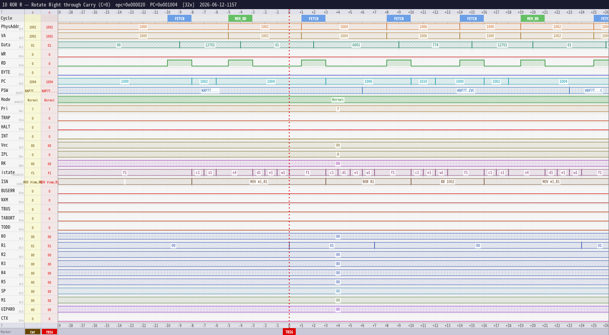</summary>


</details>

`ROR R1` はキャリービットを上位に取り込みながら 1 ビット右シフトする命令。
`MOV $1, R1` で最下位ビットのみ 1 を設定し、C=0 の状態で実行する。
`0o1 >> 1 = 0`、旧 bit0（=1）が C に入り `新 R1 = 0, 新 C = 1`。

観測ポイントは C フラグが 0→1 へ変化するタイミングと、R1 が `1`→`0` になる瞬間。
両者とも `e1` クロックで確定し `w1` でレジスタへ書き戻される。
連続 ROR では毎回 C が循環するため、キャリーの伝播が可視化できる。
istate は 5T。

### 3.2 ケース 11 — ROL R1（C=0）

<details><summary>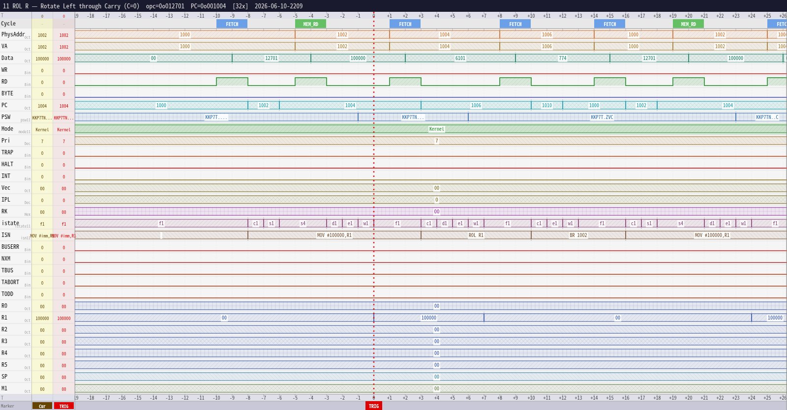</summary>


</details>

`ROL R1` はキャリービットを下位に取り込みながら 1 ビット左シフトする命令。
`MOV $100000, R1`（= bit15 のみ 1）で設定し、C=0 で実行する。
`0o100000 << 1 = 0`（16bit 幅でオーバーフロー）、旧 bit15 が C に入る。
結果: `新 R1 = 0, 新 C = 1, N=0, Z=1`。

観測ポイントはオーバーフロー時の N→Z への変化と C=1 の立ち上がり。
`0o100000` は符号ありで最小値（-32768）であり、C に押し出された後 R1=0 になる
という左シフト境界値の動作を観測できる。istate は 5T。

### 3.3 ケース 12 — ASR R1

<details><summary>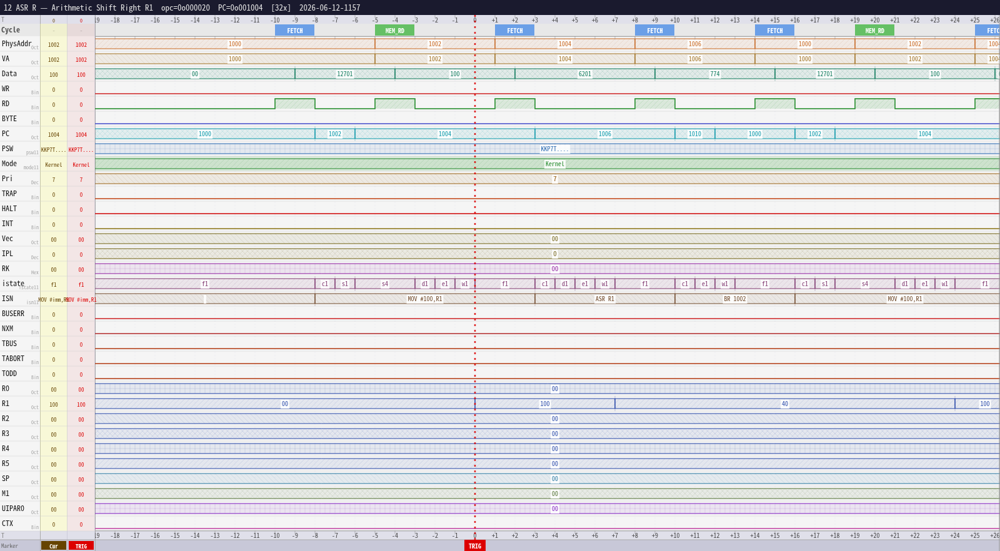</summary>


</details>

`ASR R1` は算術右シフト（符号ビット保持）命令。`MOV $100, R1`（`0o100` = 64）で
正の偶数を設定し、ASR を実行する。`0o100 >> 1 = 0o40`（= 32）。
符号ビット（bit15 = 0）は保持されるため正数のまま。

観測ポイントは R1 が `100`→`40` に変化する 2 分の 1 演算と、
C フラグに旧 bit0（= 0）が入ること（C=0）。
`0o100001`（奇数）を使えば C=1 となる。算術シフトと論理シフト（ASL）の
対称性を比較する際の基準ケースとなる。istate は 5T。

### 3.4 ケース 13 — ASL R1

<details><summary></summary>


</details>

`ASL R1` は算術左シフト（符号ビット含む）命令。`MOV $1, R1` で設定し、
`0o1 << 1 = 0o2`（= 2）。符号ビットは変化せず C=0。

観測ポイントは R1 が `1`→`2` に変化すること（2 乗算と等価）と、
V フラグ（bit14 XOR bit15 = オーバーフロー検出）が 0 のまま。
`0o40000`（bit14=1, bit15=0）を初期値にすると shift 後 V=1 になる。
istate は 5T。

### 3.5 ケース 14 — SWAB R1

<details><summary></summary>


</details>

`SWAB R1` は上位バイトと下位バイトを入れ替える命令。`MOV $1200, R1` で設定する。
`0o1200` は上位バイト `0o12`、下位バイト `0o00`。SWAB 後は上位が `0o00`、下位が `0o12`
となり `R1 = 0o0012`。

観測ポイントは R1 の値が `1200`→`0012` に変化するバイトスワップと、
PSW が**下位バイト（新しい下位バイト = 旧上位バイト）**を基準に設定される点。
`0o0012` は正数なので N=0, Z=0。istate は 5T。

### 3.6 ケース 15 — SXT R1（N=0 バリアント）

<details><summary>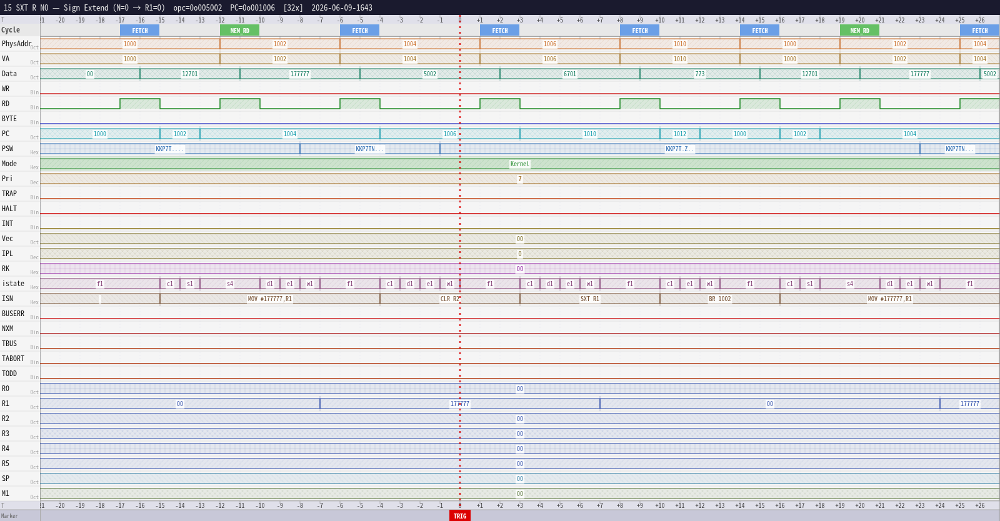</summary>


</details>

ケース 09 と同じ `SXT R1` だが、N=0 の条件下での実行。
`MOV $177777, R1` の後 `CLR R2`（PSW: N=0, Z=1）を実行し、
N フラグが 0 の状態で `0o1006` の `SXT R1` をトリガーする。
結果は `R1 ← 0`（N=0 のため）。

観測ポイントは R1 が `177777`→`0` へ変化することと、
ケース 09 と istate パターンは同じでも結果が N フラグで決まるという
`SXT` の条件付き動作の違い。両ケースを並べると PSW の役割が明確になる。
istate は 5T。

---

## 4. Phase D — Double-operand register-register（7件）

### 4.1 ケース 16 — MOV R0, R1

<details><summary>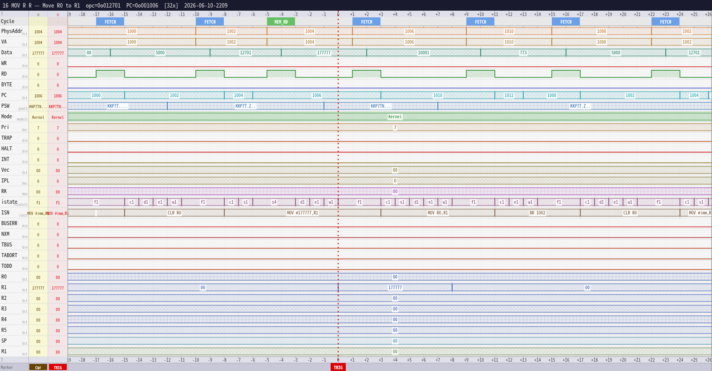</summary>


</details>

`MOV R0, R1` はソースレジスタからデスティネーションレジスタへ転送する命令。
`CLR R0` で R0=0 にし、`MOV $177777, R1` で R1 に全 1 を書いてから
`0o1006` で `MOV R0, R1` を実行する。R1 が `177777`→`0` に変化する。

観測ポイントは istate `f1→c1→s1→d1→e1→w1` の **6T パターン**（双オペランド命令の基本形）。
`s1` でソース（R0）のレジスタ番号を確定し、`d1` でデスティネーション（R1）を確定、
`e1` で転送演算を行い `w1` で書き戻す。バスアクセスはフェッチ 1 回のみ。
PSW は転送された値（0）に基づき N=0, Z=1 が設定される。

### 4.2 ケース 17 — CMP R0, R1（Z=1）

<details><summary>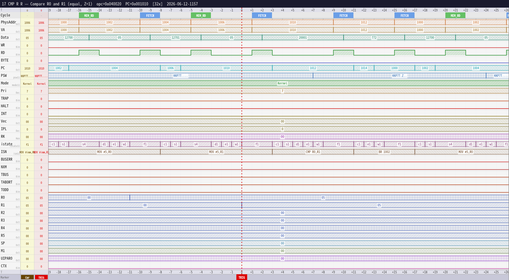</summary>


</details>

`CMP R0, R1` は比較命令——R0 - R1 を計算して PSW を更新するが、
どちらのレジスタも変更しない。`MOV $5, R0` と `MOV $5, R1`（各 2 ワード）で
両方に同値を設定し、`0o1010` で `CMP` を実行する。`5 - 5 = 0`（Z=1）。

観測ポイントは両レジスタが変化しないにもかかわらず PSW の Z=1 が設定される点。
`CMP` と `TST` はともに `w1` が出ない（書き戻しなし）が、`CMP` は
ソース取得フェーズ（`s1`）も含む 5T の変形パターン：`f1→c1→s1→d1→e1`。
プリトリガー期間には `MOV #5,R0` と `MOV #5,R1` が連続して見える。

### 4.3 ケース 18 — BIT R0, R1

<details><summary>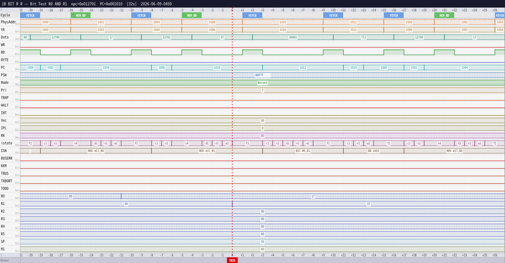</summary>


</details>

`BIT R0, R1` はビットテスト命令——`R0 AND R1` を計算して PSW を更新するが、
レジスタは変更しない。`MOV $17, R0`（下位 4 ビット）と `MOV $37, R1`（下位 5 ビット）を
設定する。`0o17 AND 0o37 = 0o17`（= 15、非ゼロ）→ Z=0。

観測ポイントは CMP と同様に `w1` が出ないパターンと、AND 演算の PSW 反映。
`BIT` は AND の「読み取り専用版」であり、フラグを見て分岐する前の前哨命令として
Unix V6 カーネルでよく使われる。istate は `f1→c1→s1→d1→e1`（5T）。

### 4.4 ケース 19 — BIC R0, R1

<details><summary>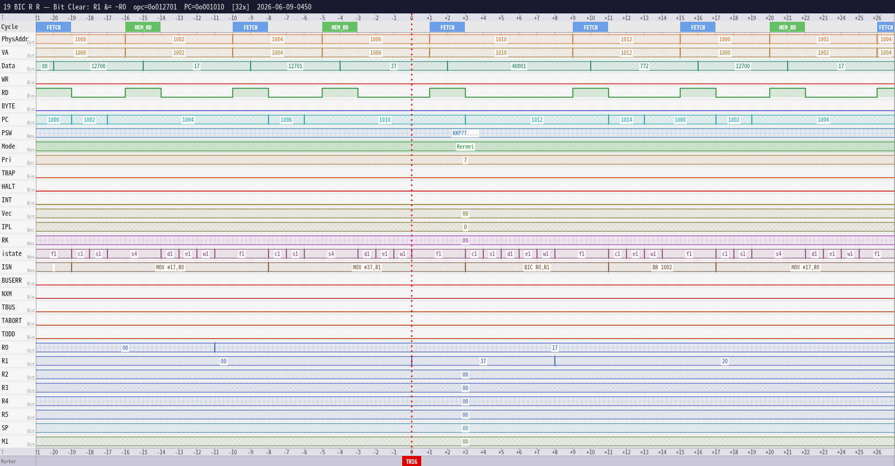</summary>


</details>

`BIC R0, R1` はビットクリア命令——`R1 ← R1 AND NOT(R0)`。
`MOV $17, R0`（マスク）と `MOV $37, R1` を設定し、`0o1010` で実行する。
`0o37 AND NOT(0o17) = 0o37 AND 0o177760 = 0o20`。

観測ポイントは R1 が `37`→`20` に変化する AND-NOT 演算と、
R0 が不変のままである点（ソースは読み取りのみ）。
`BIC` は 6T で `w1` あり（`f1→c1→s1→d1→e1→w1`）。
選択的ビットクリアはフラグレジスタ操作の典型パターン。

### 4.5 ケース 20 — BIS R0, R1

<details><summary>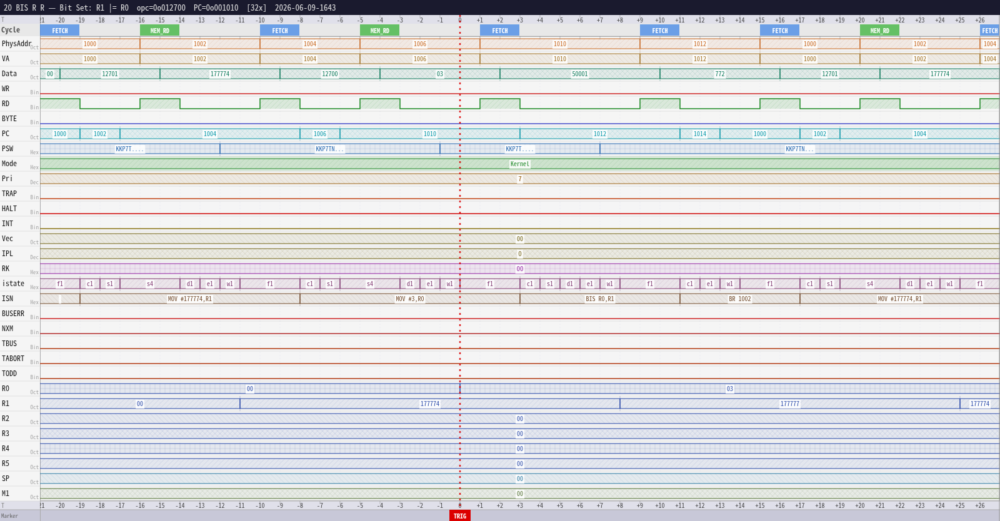</summary>


</details>

`BIS R0, R1` はビットセット命令——`R1 ← R1 OR R0`。
`MOV $177774, R1`（下位 2 ビットが 0）と `MOV $3, R0`（下位 2 ビットのみ 1）を設定し、
`0o1010` で実行する。`0o177774 OR 0o3 = 0o177777`（全ビット 1）。

観測ポイントは R1 が `177774`→`177777` へ変化する OR 演算。
N=1, Z=0 が PSW に設定される（`0o177777` は符号ありで負数）。
BIC と BIS を組み合わせるとビットフィールド操作の基本パターンとなる。
istate は 6T（`f1→c1→s1→d1→e1→w1`）。

### 4.6 ケース 21 — ADD R0, R1

<details><summary>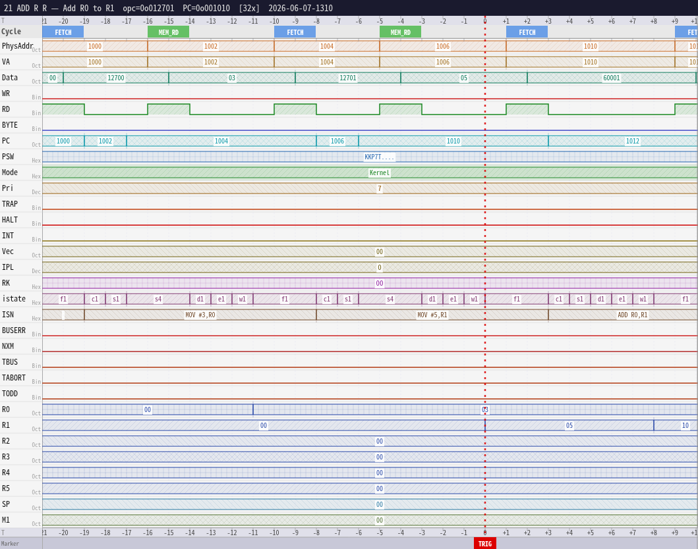</summary>


</details>

`ADD R0, R1` は加算命令——`R1 ← R1 + R0`。
`MOV $3, R0` と `MOV $5, R1` を設定し `0o1010` で実行する。
`5 + 3 = 0o10`（= 8）。キャリー・オーバーフローなし。

観測ポイントは R1 が `5`→`10`（8 進）へ変化する加算と、
C=0, V=0 の通常加算 PSW。ADD は PDP-11 の **16 ビット専用命令**（バイト版なし）。
istate は 6T。後続の SUB と対比して観測するとよい。

### 4.7 ケース 22 — SUB R0, R1

<details><summary>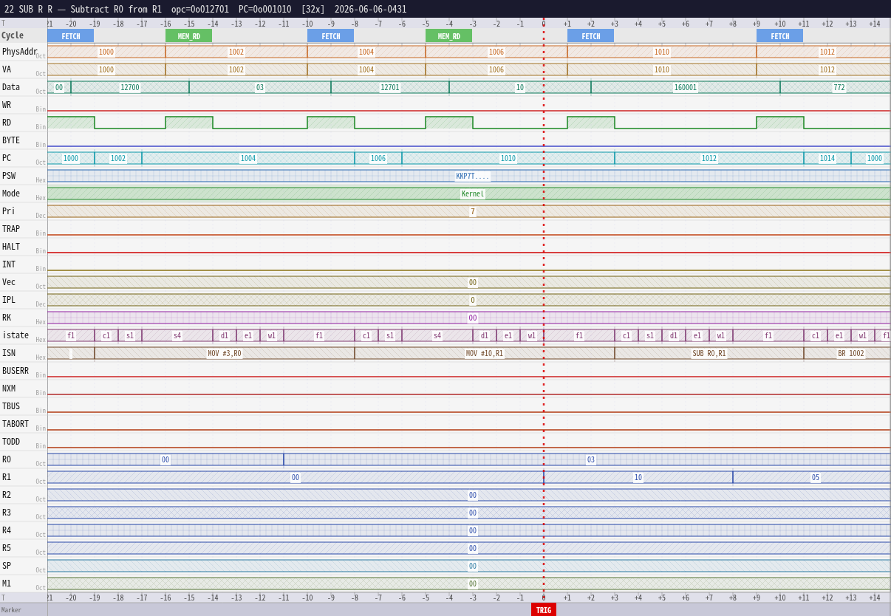</summary>


</details>

`SUB R0, R1` は減算命令——`R1 ← R1 - R0`。
`MOV $3, R0` と `MOV $10, R1`（`0o10` = 8）を設定し実行する。
`0o10 - 0o3 = 0o5`（= 5）。

観測ポイントは R1 が `10`→`5` へ変化する減算と、正の結果なので N=0, Z=0。
ADD と同様に 6T パターン。`SUB` も 16 ビット専用命令（`SUBB` は存在しない）。

---

## 5. Phase E — 即値オペランド（4件）

### 5.1 ケース 23 — MOV #5, R1（即値転送）

<details><summary>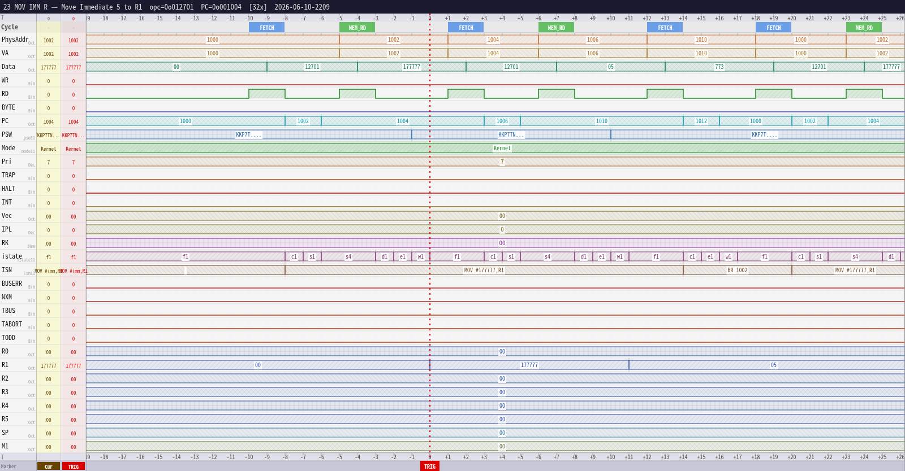</summary>


</details>

`MOV #5, R1` は 2 ワード即値命令（オペコード + 即値 `5`）。
プリトリガー期間に `MOV $177777, R1` で R1 を設定してから
`0o1004` で `MOV #5, R1` を実行する。`R1 ← 5`。

観測ポイントは FETCH が **2 回連続**で現れる点——1 回目がオペコード、
2 回目が即値ワード。istate は `f1→c1→s1→s4→d1→e1→w1`（**7T**）で、
`s4` クロックで `PC` が示すアドレス（即値格納アドレス）から値を読み `PC += 2` する。
プリトリガーの ISN 行に `MOV #177777,R1` が先行して見える。

### 5.2 ケース 24 — ADD #3, R1（即値加算）

<details><summary>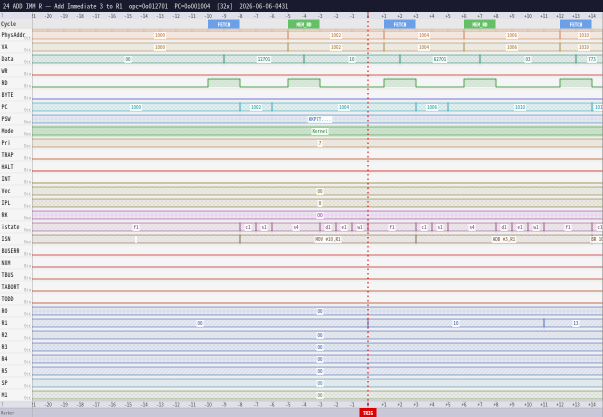</summary>


</details>

`MOV $10, R1`（`0o10` = 8）で初期化してから `0o1004` で `ADD #3, R1` を実行する。
`0o10 + 3 = 0o13`（= 11）。

観測ポイントは即値の FETCH と加算演算の組み合わせ。
istate は `f1→c1→s1→s4→d1→e1→w1`（7T）。
`s4` の MEM_RD でバス上に即値 `3` が現れ、R1 の演算に入力される。
即値命令（Phase E）は全て 7T で統一されている点が Phase D の 6T と異なる。

### 5.3 ケース 25 — CMP #5, R1（即値比較、Z=1）

<details><summary>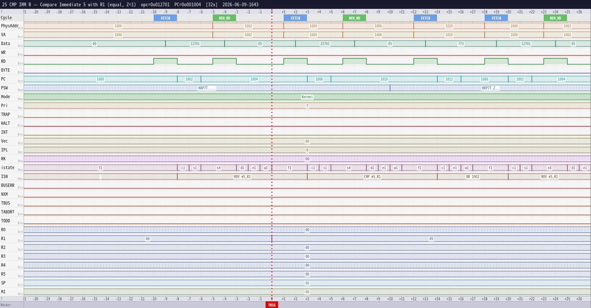</summary>


</details>

`MOV $5, R1` で初期化し `0o1004` で `CMP #5, R1` を実行する。
即値 `5` と R1=`5` の比較なので `5 - 5 = 0`（Z=1）。

観測ポイントは即値 FETCH の後に比較演算があり、**`w1` が出ない**（CMP は書き戻しなし）。
istate は `f1→c1→s1→s4→d1→e1`（6T、w1 なし）。
レジスタ間 CMP（5T）と比較すると即値フェッチ分だけ 1T 多い。

### 5.4 ケース 26 — BIS #017, R1（即値ビットセット）

<details><summary>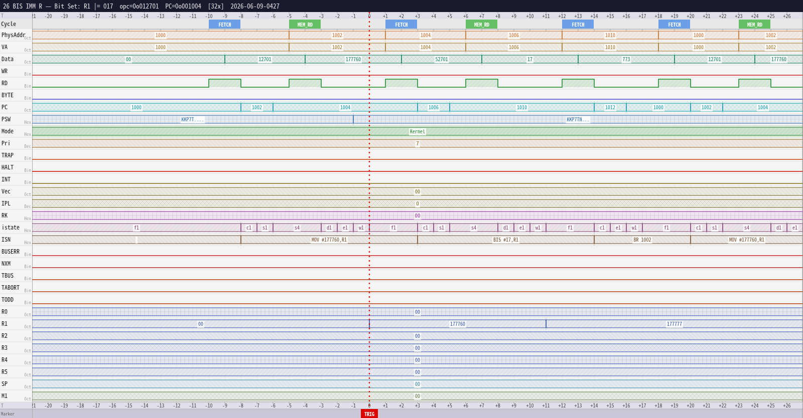</summary>


</details>

`MOV $177760, R1`（下位 4 ビットが 0）で初期化し `0o1004` で `BIS #17, R1` を実行する。
`0o177760 OR 0o17 = 0o177777`（全ビット 1）。

観測ポイントは即値 OR 演算と、R1 が `177760`→`177777` へ変化するタイミング。
`0o17` の即値が `s4` の MEM_RD で読み取られ、BIS 演算の第 1 オペランドになる。
istate は 7T（w1 あり）。Phase D の `BIS R0,R1`（6T）と 1T 差があることを確認できる。

---

## 6. Phase F — メモリアクセス（6件）

### 6.1 ケース 27 — MOV (R1), R2（間接ロード）

<details><summary>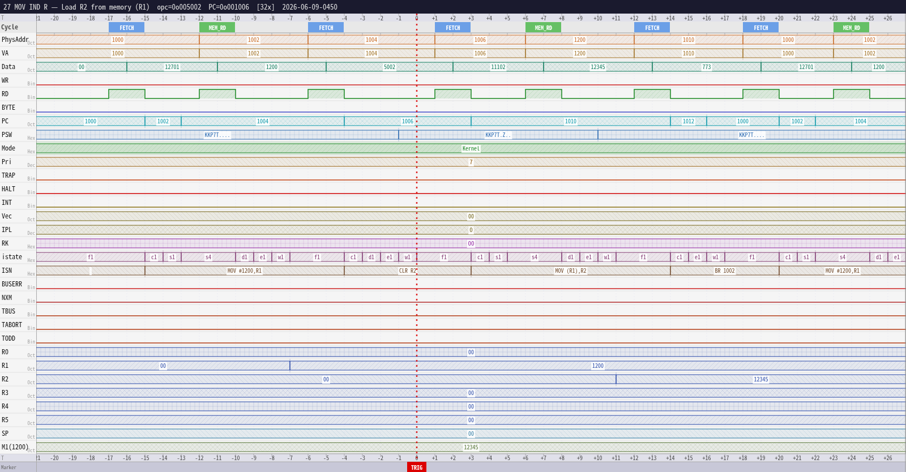</summary>


</details>

R1 = `0o1200`（`MOV $01200, R1` で設定）、`CLR R2` の後に
`0o1006` で `MOV (R1), R2` を実行する。データ領域 `0o1200` には `0o12345` が配置されている。

観測ポイントは `s4` クロックで `addr_p = 0o1200` の MEM_RD バスサイクルが
発生し、`data = 0o12345` が読み取られる点。M1 プローブ（`mem_probe=0o1200`）で
メモリ内容がタイミング図上に表示される。R2 が `0`→`12345` に変化するのは `w1` クロック。
istate は `f1→c1→s1→s4→d1→e1→w1`（7T）。

### 6.2 ケース 28 — MOV R2, (R1)（間接ストア）

<details><summary>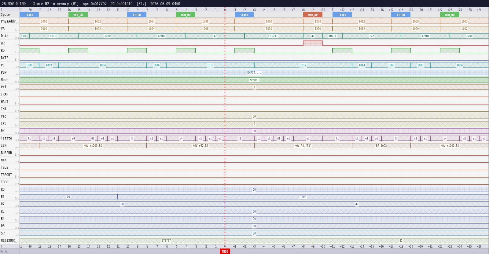</summary>


</details>

R1 = `0o1200`、R2 = `0o42`（`MOV $042, R2` で設定）の状態で
`0o1010` で `MOV R2, (R1)` を実行する。データ領域には `0o177777` を初期配置。

観測ポイントは `d4` クロックで `bus_wr=1` の MEM_WR バスサイクルが発生し、
`data = 0o42` がアドレス `0o1200` へ書き込まれる点。
ロード（ケース 27）と比べると MEM_WR の位置が `d4`（デスト確定後）に変わる。
istate は `f1→c1→s1→d1→d4→e1→w1`（7T）。

### 6.3 ケース 29 — MOV (R1)+, R2（後置インクリメント）

<details><summary>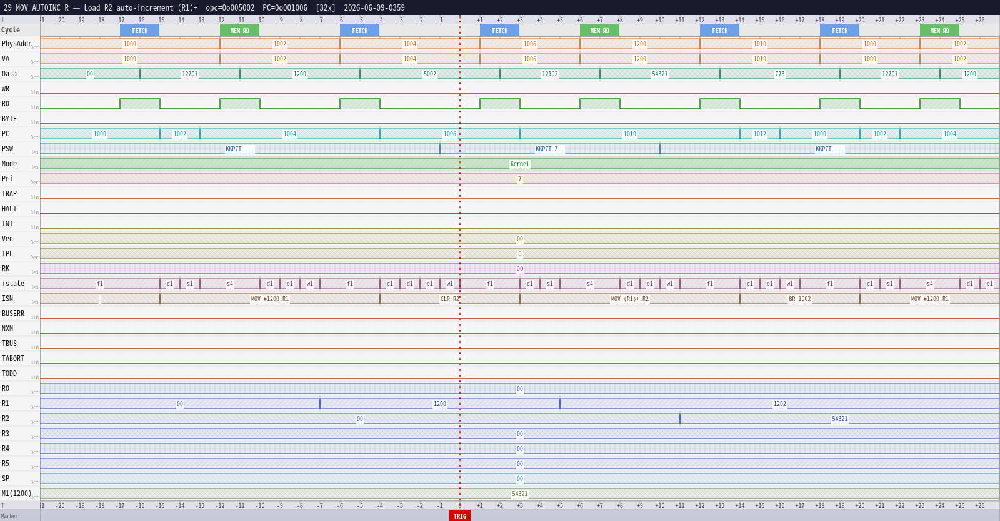</summary>


</details>

R1 = `0o1200` の状態で `0o1006` で `MOV (R1)+, R2` を実行する。
データ領域 `0o1200` には `0o54321` が配置されている。
実行後 R1 は `0o1200`→`0o1202`（ワードサイズ +2 されてインクリメント）。

観測ポイントは `s2` クロックで R1 がインクリメントされる点（`s4` のメモリ読み出し前に
R1 は既に +2 された値になっている）と、その後 `s4` で M[1200] を読む MEM_RD サイクル。
istate は `f1→c1→s1→s2→s4→d1→e1→w1`（**8T**）。自動インクリメントは通常の間接より 1T 多い。

### 6.4 ケース 30 — MOV -(R1), R2（前置デクリメント）

<details><summary></summary>


</details>

R1 = `0o1202` の状態で `0o1006` で `MOV -(R1), R2` を実行する。
`s1` で `R1 ← R1 - 2 = 0o1200` され、その後 M[1200] = `0o76543` を読む。

観測ポイントは `s1` クロックで R1 が `-2` されることと（メモリ読み出し前）、
インクリメント（ケース 29）が `s2` でポスト処理されるのに対しデクリメントが
`s1` でプリ処理される非対称性。istate は `f1→c1→s1→s4→d1→e1→w1`（7T）。

### 6.5 ケース 31 — MOV 2(R1), R2（インデックスアドレッシング）

<details><summary>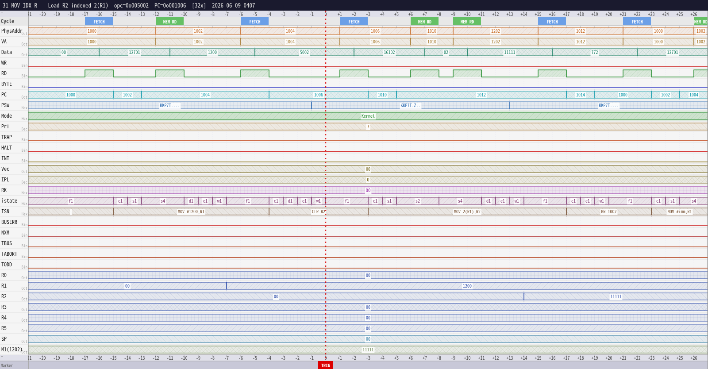</summary>


</details>

R1 = `0o1200` の状態で `0o1006`〜`0o1011`（2 ワード命令）の `MOV 2(R1), R2` を実行する。
データ領域は `0o1200` に `0`、`0o1202` に `0o11111` が配置されている。
実効アドレス = `R1 + 2 = 0o1202`、読み出し値は `0o11111`。

観測ポイントは **3 回のバスアクセス**（オペコード FETCH → オフセット `2` の FETCH → M[1202] の MEM_RD）。
`s1` でオフセットワードをフェッチ（FETCH）し、`s2` で実効アドレス `R1 + offset` を計算、
`s4` でデータを読む。istate は `f1→c1→s1→s2→s4→d1→e1→w1`（8T）。
インデックスは 3 バスアクセスという点でアドレッシングモード中最もコストが高い。

### 6.6 ケース 32 — MOVB (R1), R2（バイトロード・符号拡張）

<details><summary></summary>


</details>

R1 = `0o1200`、データ `0o0377`（= `0xFF`）が `0o1200` に配置された状態で
`0o1006` で `MOVB (R1), R2` を実行する。

観測ポイントは `byte_op` 信号が MEM_RD サイクル中に High になること、
そして R2 が `0`→`177777` に変化する**符号拡張**の動作。
`0o377` のバイト（bit7=1）をレジスタに格納すると PDP-11 は自動的に
16 ビットに符号拡張するため、上位バイトが `0o177400` で埋まり結果は `0o177777`。
メモリに格納する `MOVB` なら上位バイトは不変だが、レジスタ宛ては符号拡張が必須。
istate は 7T。

---

## 7. Phase G — 分岐命令（8件）

### 7.1 ケース 33 — BR（無条件分岐・取得）

<details><summary>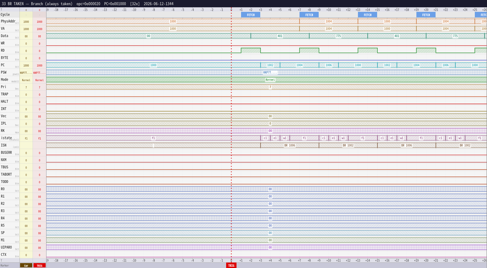</summary>


</details>

`BR done` を `0o1000` に配置し、直後の `NOP` をスキップして `done:` へジャンプする。

観測ポイントは分岐命令の最短 istate シーケンス `f1→c1→e1`（**3T**）と、
`e1` 後の `PC` が分岐先アドレスになること。バスアクセスは FETCH 1 回のみ。
`w1` が出ない（PSW を更新しない）。取得後に `done:` の FETCH が続く。

### 7.2 ケース 34 — BNE 取得（Z=0）

<details><summary>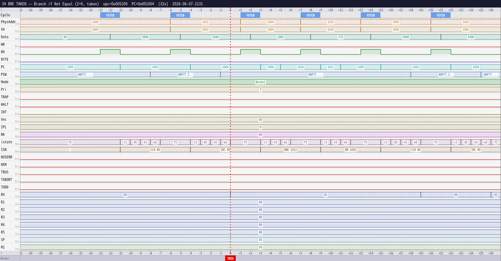</summary>


</details>

`CLR R0`（Z=1）の後 `INC R0`（Z=0 になる）を実行し、`0o1004` で `BNE done` をトリガーする。
Z=0 なので「Not Equal」条件が成立し分岐取得。

観測ポイントは istate 3T と、`e1` 後に PC が `done:` アドレスへ変化する点。
プリトリガーでの Z フラグ変化（`CLR`→`INC` の順）が ISN 行から読み取れる。
BNE の典型的な使い方（ループ末尾の「まだゼロでなければ繰り返す」）の基本形。

### 7.3 ケース 35 — BNE 非取得（Z=1）

<details><summary>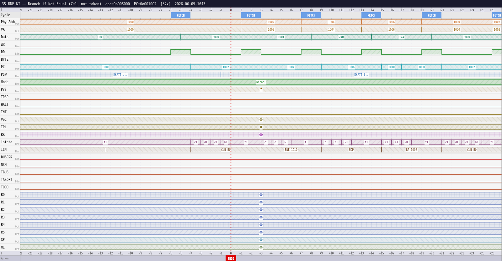</summary>


</details>

`CLR R0`（Z=1）の後すぐ `0o1002` で `BNE done` をトリガーする。
Z=1 なので「Not Equal」条件が不成立——フォールスルーして `NOP` へ進む。

観測ポイントは**取得と非取得で istate パターンが同じ**（3T）である点。
違いは `e1` 後の PC のみ——取得なら分岐先、非取得なら `0o1004`（BNE 命令の次アドレス）。
ケース 34 と波形を並べると分岐条件の違いが PC の変化に凝縮される。

### 7.4 ケース 36 — BEQ 取得（Z=1）

<details><summary>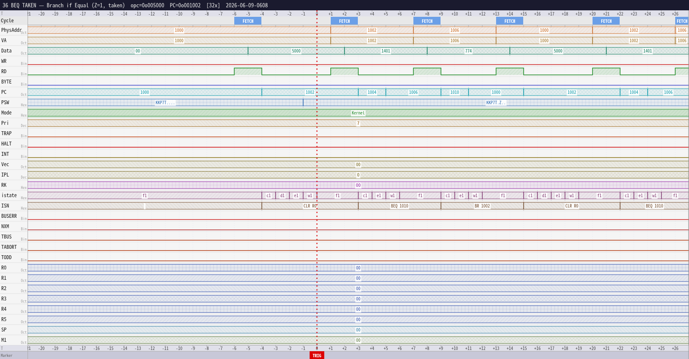</summary>


</details>

`CLR R0` で Z=1 にした後 `0o1002` で `BEQ done` を実行する。
Z=1 なので「Equal」条件が成立し分岐取得。

観測ポイントは BNE 取得（ケース 34）と対称的なフラグ依存パターン。
istate は 3T で同一。BEQ は「ゼロか確認してジャンプ」の最頻出パターンの一つ。

### 7.5 ケース 37 — BGE 取得（N=V=0）

<details><summary></summary>


</details>

`CLR R0` で N=0, V=0 にした後 `0o1002` で `BGE done` を実行する。
BGE の条件は `N XOR V = 0`（符号なし ≥ 0）で、N=V=0 なので成立。

観測ポイントは BGE が PSW の **N と V の XOR** で判定するという
符号あり比較の仕組み。オーバーフロー（V=1）時に符号反転するため、
単純に N=0 を見るのではなく `N XOR V` を使う PDP-11 の条件分岐設計が確認できる。
istate は 3T。

### 7.6 ケース 38 — BLT 取得（N=1, V=0）

<details><summary>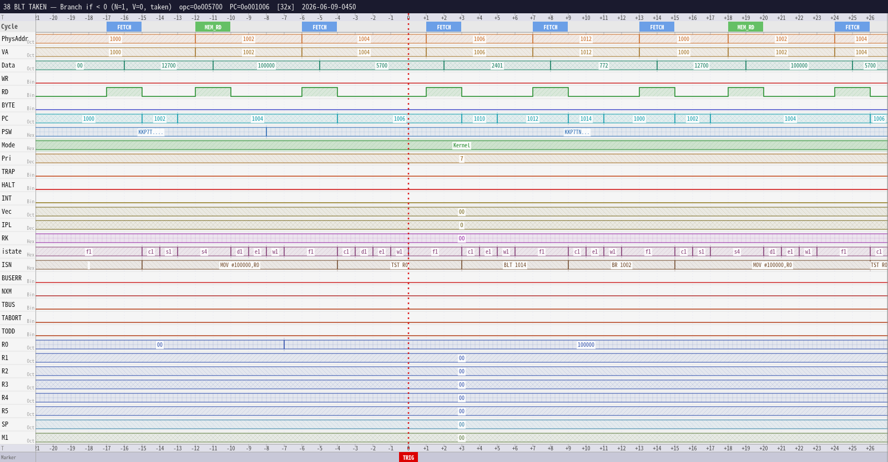</summary>


</details>

`MOV $100000, R0`（符号ありで最小値 -32768）の後 `TST R0` で N=1 を確認し、
`0o1006` で `BLT done` を実行する。BLT の条件は `N XOR V = 1`——N=1, V=0 なので成立。

観測ポイントは BGE と対になる符号あり比較で、N=1 の負数を `TST` で
検査してから分岐するパターン。プリトリガーに `MOV #100000,R0`→`TST R0` の
2 命令が連続して見える。istate は 3T。

### 7.7 ケース 39 — BCC 取得（C=0）

<details><summary>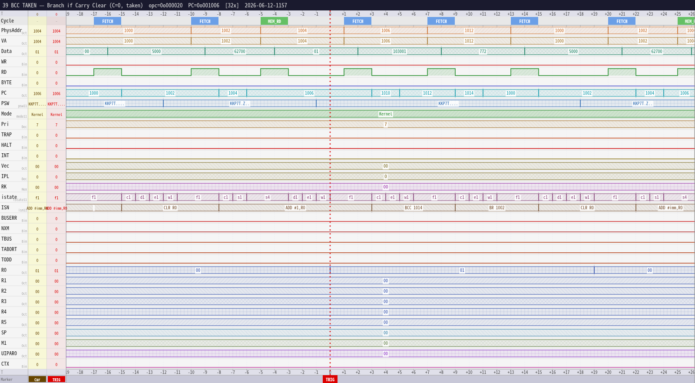</summary>


</details>

`CLR R0` の後 `ADD $1, R0` でキャリーなし加算（C=0）し、`0o1006` で `BCC done` を実行。
`0 + 1 = 1`（桁上がりなし）なので C=0、分岐取得。

観測ポイントはキャリーフラグを条件とする分岐。
BCC/BCS は符号なし多倍長演算や文字列比較でよく使われる。
istate は 3T。

### 7.8 ケース 40 — BCS 取得（C=1）

<details><summary>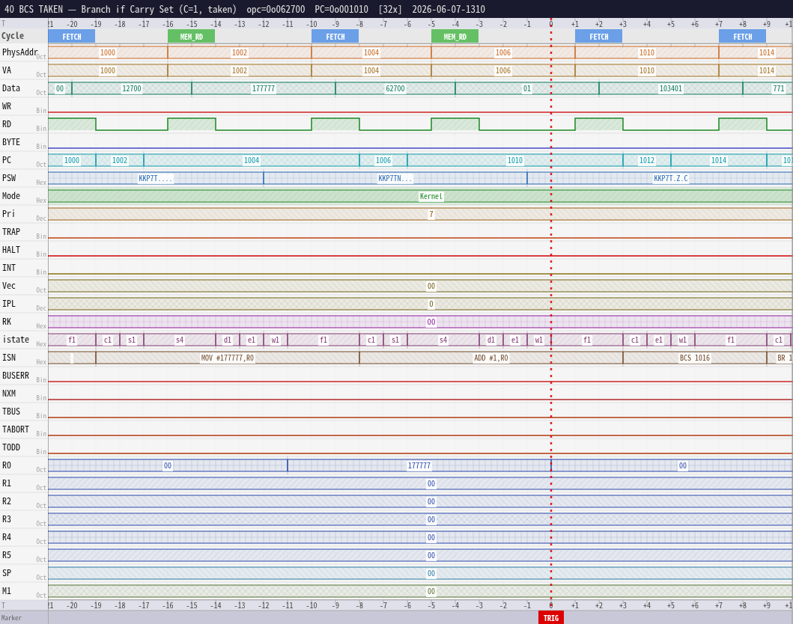</summary>


</details>

`MOV $177777, R0` の後 `ADD $1, R0` で `0o177777 + 1 = 0`（C=1 オーバーフロー）し、
`0o1010` で `BCS done` を実行する。C=1 なので分岐取得。

観測ポイントは C=1 を生成するための加算（16 ビット最大値 + 1 = 0 + キャリー）の
プリトリガー波形と、BCS でキャリーを正しく検出できること。
BCC（ケース 39）と比較するとキャリーの有無で分岐先が逆になる。
istate は 3T。

---

## 8. Phase H — JSR/RTS（2件）

### 8.1 ケース 41 — JSR R5, sub

<details><summary>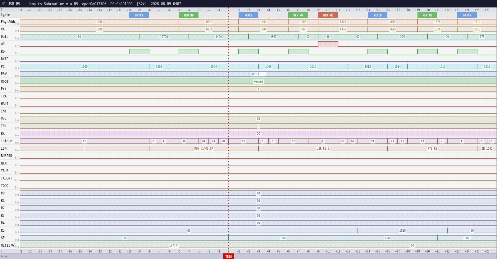</summary>


</details>

`MOV $01400, SP` でスタックを `0o1400` に初期化してから
`0o1004` で `JSR R5, sub` を実行する（`sub` のアドレスは後続の `RTS R5` が置かれた番地）。
`0o1376` には初期値 `0o177777` を配置してスタックへの書き込みを確認できるようにする。

観測ポイントは `JSR` のシーケンス: SP が `-2`（`p1` クロック）→ `M[SP] ← R5`（MEM_WR）→
`R5 ← 戻りアドレス（PC）`→ `PC ← sub のアドレス`。
istate は `f1→c1→s*→e1→p1→w1`（**7〜10T**）で、`p1` で MEM_WR が発生する。
スタック書き込みは `M[0o1376]` に R5 の古い値が入り、M1 プローブで確認できる。
`JSR` は PDP-11 固有の「リンクレジスタ渡しサブルーチン呼び出し」で、
R5 にリターンアドレスを格納しつつスタックに旧 R5 を退避する。

### 8.2 ケース 42 — RTS R5

<details><summary>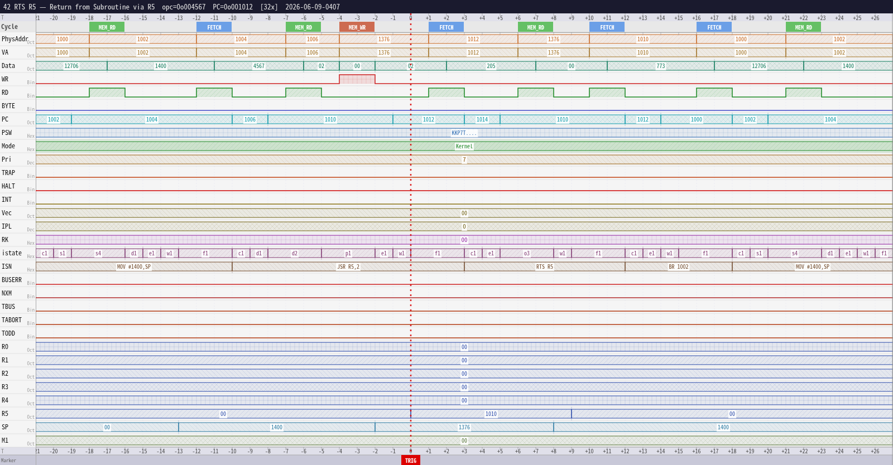</summary>


</details>

ケース 41 と同じプリアンブル（`MOV $01400, SP` + `JSR R5, sub`）の後、
`sub:` 内の `0o1012` で `RTS R5` をトリガーする。

観測ポイントは `RTS` のシーケンス: `PC ← R5`（R5 にある戻りアドレスを PC に）→
`R5 ← M[SP]`（スタックから旧 R5 を復元、`o1` クロックで MEM_RD）→ `SP += 2`。
istate は `f1→c1→o1→e1`（**4〜5T**）で `o1` クロックに MEM_RD が現れる。
JSR/RTS の対称的な動作（スタック操作の逆順）が波形から直接読み取れる。

### 8.3 設計メモ — `JSR Rx` の哲学と現代的評価

#### `JSR PC` vs `JSR Rx` の違い

`JSR PC, dst`（R7=PC を使用）は現代の CALL と等価——リターンアドレスをスタックに積んでジャンプする。
`JSR Rx, dst`（Rx ≠ PC）は動作が異なる:

```text
1. -(SP) ← Rx          旧 Rx をスタックに退避
2. Rx    ← PC          リターンアドレスを Rx レジスタへ
3. PC    ← dst         サブルーチンへジャンプ
```

リターンアドレスがスタックではなく**汎用レジスタ**に入る点が特徴的。

#### ユースケース①: ハードウェアコルーチン

```asm
; 呼び出し元
JSR R3, coro_body     ; R3 = 戻りアドレスA、旧R3はスタック

; coro_body 内で制御を返す
JSR R3, caller_cont   ; R3(=A)をスタックに積み、R3=戻りアドレスB、PC=A へ
```

resume アドレスの交換を 1 命令で実現。OS なしのコルーチンが可能。

#### ユースケース②: インラインパラメータ渡し（FORTRAN 時代の慣習）

```asm
JSR R5, print_msg
.ascii "Hello\n"      ; コードストリームに定数を埋め込む
.even
; R5 が自動的にここまで進んで実行継続

print_msg:
    movb (R5)+, R0    ; R5 はパラメータ列をポインタとして走査
    bne  print_msg
    rts  R5           ; R5 = 文字列末尾の次アドレス → 帰還
```

#### 現代アーキテクチャ観点での評価

| 観点 | 評価 |
|------|------|
| 直交性・表現力 | リンクレジスタを任意に選べる柔軟な設計 |
| コルーチン | ハードウェアで 1 命令、OS 不要 |
| **Return Stack Buffer (RSB)** | `JSR PC / RTS PC` のみ RSB 予測対応。`JSR Rx` は間接ジャンプ扱いになり分岐予測ミスが発生しやすい |
| **W^X セキュリティ** | インラインパラメータはコードとデータを混在させるため現代のセキュリティポリシーに違反 |
| **Spectre v2 (BTI)** | `RTS Rx` は毎回間接ジャンプになり Branch Target Injection の攻撃面となる |
| ABI 複雑性 | 呼び出し規約が複数存在できてしまう。実際 Unix/C では `JSR PC` に収束し Rx ≠ PC は事実上の死に機能化 |

#### RISC-V JAL との比較

RISC-V の `JAL rd, dst` は PDP-11 `JSR Rx, dst` と同じ哲学（任意 GPR にリターンアドレスを格納）を持つ。
ただし RISC-V は ABI で「`ra`（x1）を使った場合に限りハードウェアが return 予測する」と規定することで
RSB 問題を解決した。PDP-11 の設計から 50 年後の改良版と言える。

---

## 9. Phase I — JMP, SOB（3件）

### 9.1 ケース 43 — JMP (R1)（間接ジャンプ）

<details><summary>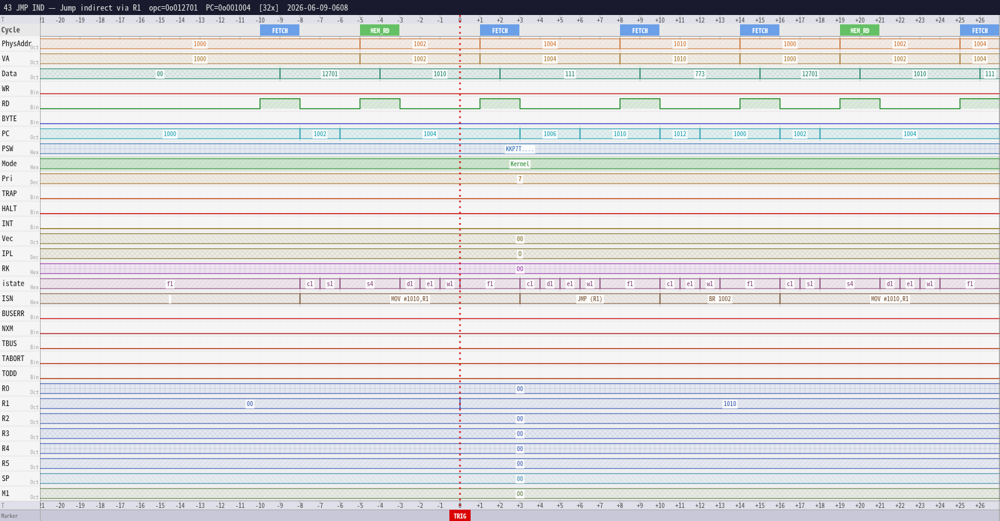</summary>


</details>

`MOV $done, R1` で `done:` ラベルのアドレスを R1 に書き込み、
`0o1004` で `JMP (R1)` を実行する（レジスタ間接ジャンプ = モード 1）。

観測ポイントは `JMP` が分岐命令（3T）と異なり実効アドレス計算ステップを経る点。
istate は `f1→c1→s*→e1` で、`s1` クロックで R1 からアドレスを取り出す。
`w1` はなし（レジスタへの書き戻しなし）。`PC` が `R1` の値（`done:` のアドレス）に
変化するのが `e1` クロック。

### 9.2 ケース 44 — SOB 取得（R1=2→1）

<details><summary>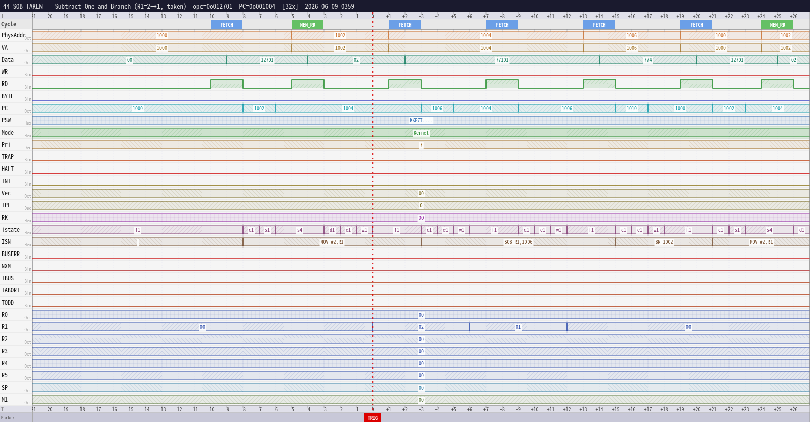</summary>


</details>

`MOV $2, R1` で R1=2 を設定し、`0o1004` の `SOB R1, loop` で R1 を -1 して
0 でなければ `loop:` へジャンプ（`R1: 2→1 ≠ 0` → 取得）。

観測ポイントは `SOB`（Subtract One and Branch）の istate シーケンス `f1→c1→e1`（3T）が
分岐命令と同じ最短パターンであること。`e1` で R1 のデクリメントと分岐判定が同時に行われる。
SOB は C ループの末尾処理で最頻出——`do { ... } while (--r1 != 0)` に相当。

#### `SOB Rn, off` の `off` について

`off` は**後退オフセット**（6 ビット正整数）。ジャンプ先アドレスは次式で計算される。

```text
ジャンプ先 = (SOB 命令の次アドレス) − 2 × off
```

命令語ビット配置:

```text
15      9  8  6  5       0
┌─────────┬────┬──────────┐
│ 0111 11 │ Rn │  offset  │
└─────────┴────┴──────────┘
 (SOB opc) (3b)   (6b)
```

| 特性 | 内容 |
|------|------|
| 方向 | **後退専用**（前方ジャンプ不可） |
| 最大射程 | 2 × 63 = 126 バイト後退 |
| 使用レジスタ | R0〜R5（SP/PC は不可） |

アセンブラでは `SOB R1, loop` とラベルを書けばオフセットが自動計算される。
ディスアセンブラはシンボルを持たないため `SOB R1, 3`（ワード数）のように数値表示する。

### 9.3 ケース 45 — SOB 非取得（R1=1→0）

<details><summary>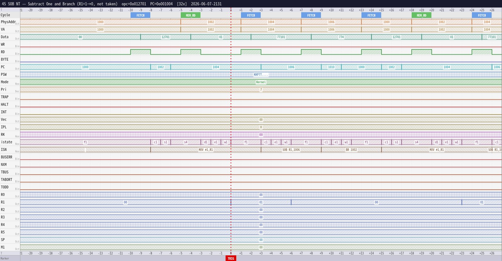</summary>


</details>

`MOV $1, R1` で R1=1 を設定し、`SOB R1, loop` で R1=0（ループ終了）。
`R1: 1→0` なので分岐しない。

観測ポイントは SOB 取得（ケース 44）と istate パターンが同じ 3T で、
違いは `e1` 後の PC のみ——非取得なら次命令 (`0o1006`) へ進む。
R1 が `1`→`0` に変化するのは `e1` クロック（w1 ではなく e1 で確定）。
ケース 44 と波形を並べると「実行コストが取得/非取得で変わらない」ことが確認できる。

---

## 10. Phase J — バイト命令（4件）

### 10.1 ケース 46 — MOVB R0, R1（バイト転送・符号拡張）

<details><summary>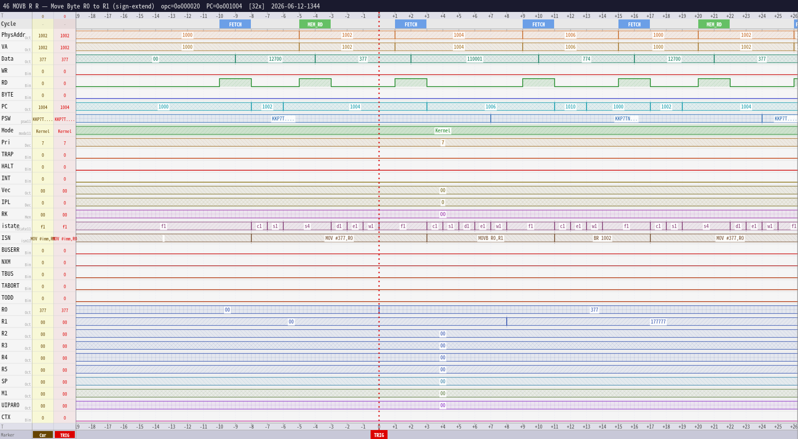</summary>


</details>

`MOV $377, R0` で R0 の下位バイトを `0o377`（= `0xFF`）にし、
`0o1004` で `MOVB R0, R1` を実行する。

観測ポイントは R0 の**下位バイトのみ**が R1 へ転送され、かつ**符号拡張**が行われる点。
R0 下位 = `0o377`（bit7=1）なので R1 = `0o177777`（全ビット 1 に拡張）。
バイト命令ではあるがレジスタ宛てであるため、バスアクセスは FETCH のみ（1 回）。
istate は 5T（`f1→c1→s1→d1→e1`; バイト版の `TST` / `CMP` 同様に `w1` は…
実際には `w1` ありで R1 が更新される）。

> **PDP-11 固有**: `MOVB Rn, Rm`（レジスタ→レジスタ）は
> ソースの下位バイト符号拡張で 16 ビットに広げた値をデスト全 16 ビットに格納する。
> メモリ→レジスタの `MOVB (R1), R2` と同じ挙動。

### 10.2 ケース 47 — CLRB R1（下位バイトクリア）

<details><summary></summary>


</details>

`MOV $177777, R1`（全ビット 1）の後 `0o1004` で `CLRB R1` を実行する。
`CLRB` は R1 の**下位バイトのみ**を 0 にし、上位バイトは保持する。
結果: `R1 = 0o177400`（上位 `0o177400` は変化なし）。

観測ポイントは上位バイトが保持される点と、PSW が下位バイトのみを基準に
N=0, Z=1 に設定されること（下位バイト = 0）。
`CLR R1`（ケース 01）と比べると結果値が異なる（全クリアvs下位のみ）。
istate は 5T。

### 10.3 ケース 48 — INCB R1（下位バイトインクリメント）

<details><summary>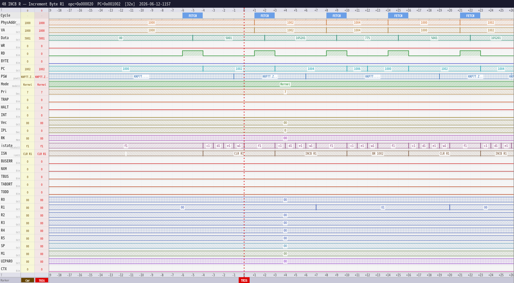</summary>


</details>

`CLR R1` の後 `0o1002` で `INCB R1` を実行する（R1 = 0 → 下位バイト +1 → R1 = 1）。
シンプルなケースで INCB の基本動作を確認する。

観測ポイントは下位バイトのみ +1 され上位バイトは不変（ゼロのまま）である点。
バイトオーバーフロー境界（`0o377 → 0o000`）では符号ありオーバーフロー（V=1）が
発生するが、本ケースでは V=0 の通常パターン。
istate は 5T。

### 10.4 ケース 49 — CMPB R0, R1（バイト比較、Z=1）

<details><summary>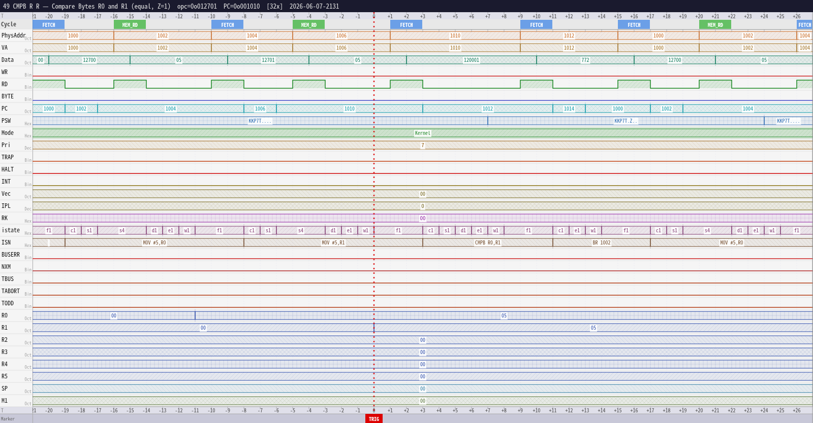</summary>


</details>

`MOV $5, R0` と `MOV $5, R1` を設定し `0o1010` で `CMPB R0, R1` を実行する。
下位バイト同士の比較（`5 - 5 = 0`）で Z=1。

観測ポイントは `CMPB` が **下位 8 ビットのみ**を比較する点（上位バイトは無視）。
istate は `CMP`（ケース 17）と同じ 5T パターン（`f1→c1→s1→d1→e1`、`w1` なし）。
バイトデータの配列要素比較などで使用される典型パターン。

---

## 11. Phase K — アドレッシングモード展示（5件）

Phase K は `MOV` 命令を固定して各アドレッシングモードを系統的に比較する。
バスアクセス回数・istate 段数・R0 の変化有無が視覚的に対比できる。

### 11.1 ケース 50 — Mode 0: MOV R0, R1（レジスタ直接）

<details><summary>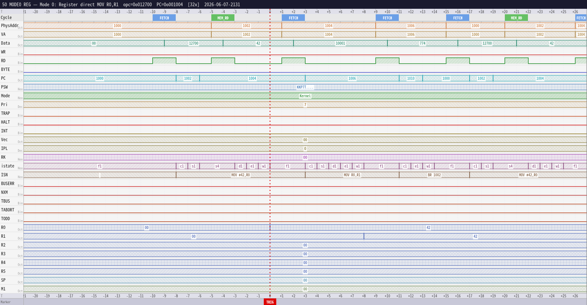</summary>


</details>

`MOV $042, R0` で R0=`0o42` を設定し `0o1004` で `MOV R0, R1` を実行する。

観測ポイントは**バスアクセス 1 回**（FETCH のみ）と 6T の最短双オペランドパターン。
レジスタ直接（Mode 0）はメモリを一切触れない最高速アドレッシング。
Phase D の MOV R0,R1（ケース 16）と同じ構造で、Phase K の基準ケース。

### 11.2 ケース 51 — Mode 1: MOV (R0), R1（レジスタ間接）

<details><summary></summary>


</details>

R0=`0o1200`、M[1200]=`0o123` の状態で `0o1006` で `MOV (R0), R1` を実行する。

観測ポイントは Mode 0 との差分——`s4` クロックで MEM_RD（FETCH ではなく green の帯）が
追加される点。バスアクセスが FETCH 1 回 + MEM_RD 1 回の計 2 回になり 7T。
M1 プローブで M[1200] の値がタイムライン上に表示される。

### 11.3 ケース 52 — Mode 2: MOV (R0)+, R1（後置オートインクリメント）

<details><summary>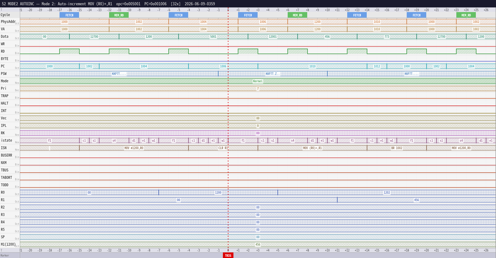</summary>


</details>

R0=`0o1200`、M[1200]=`0o456` の状態で `0o1006` で `MOV (R0)+, R1` を実行する。
実行後 R0: `0o1200`→`0o1202`。

観測ポイントは Mode 1 との差分——`s2` クロックが追加され R0 が先にインクリメント
されてから `s4` でメモリを読む。istate は 8T（Mode 1 より 1T 多い）。
R0 の変化タイミングが `s2`（メモリアクセス前）であることが波形から明確に確認できる。

### 11.4 ケース 53 — Mode 4: MOV -(R0), R1（前置オートデクリメント）

<details><summary>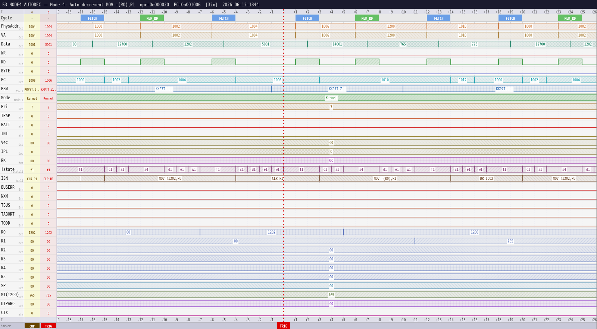</summary>


</details>

R0=`0o1202`、M[1200]=`0o765` の状態で `0o1006` で `MOV -(R0), R1` を実行する。
`s1` で R0: `0o1202`→`0o1200`（先にデクリメント）してから `s4` で M[1200] を読む。

観測ポイントは Mode 2 との非対称性——インクリメントは `s2` だがデクリメントは
`s1` で発生する（プリデクリメントはソースアドレス計算の最初の段階）。
istate は 7T（Mode 1 と同じ段数だが `s2` の代わりに `s1` でデクリメント）。

### 11.5 ケース 54 — Mode 6: MOV 2(R0), R1（インデックスアドレッシング）

<details><summary>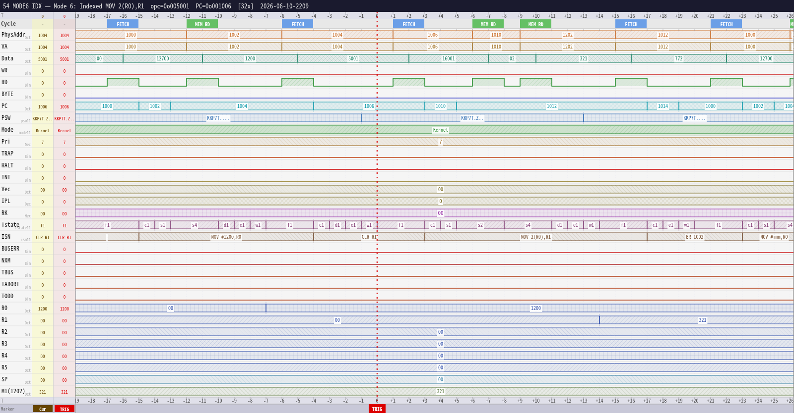</summary>


</details>

R0=`0o1200`、M[1200]=`0`、M[1202]=`0o321` の状態で
`0o1006`〜`0o1011`（2 ワード命令）の `MOV 2(R0), R1` を実行する。
実効アドレス = `R0 + 2 = 0o1202`、値 `0o321` が R1 に入る。

観測ポイントは**最多 3 バスアクセス**（オペコード FETCH → オフセット `2` の FETCH → M[1202] の MEM_RD）。
`s1` でオフセットを FETCH し（PC が +2）、`s2` で実効アドレス計算、`s4` でデータ読み出し。
istate は 8T。Mode 0〜4〜6 を並べると「メモリ参照を追うごとにバスアクセスと istate が増える」
アドレッシングモードのコスト階層が一目で把握できる。

---

## 12. Phase N — EIS 命令（6件）

EIS（Extended Instruction Set）はソフトウェアで代替していたがタイムスタンプにより、
cpus-pdp11 RTL が `mul1616.v` / `div3216.v` / `shift32.v` を同梱してフルに実装していることが確認済み。
本フェーズでは各命令の**ハードウェアマルチサイクル待機**をタイミング図で可視化する。

zoom=8 を採用（8080 フェーズ比の 1/4）。1100px ビューポートで約 137 サンプルが表示され、
MUL の ~16 クロック、DIV の ~32 クロックのフラット待機期間が画面内に収まる。

信号グループは `SIG_EIS = SIG_STD + ['istate', 'r0', 'r1']` 。
r0/r1 を加えることで積・商・余数が格納される瞬間を直接観察できる。

---

### 12.1 ケース 55 — MUL R1, R0（16×16 乗算）

<details>
<summary>タイミング図</summary>

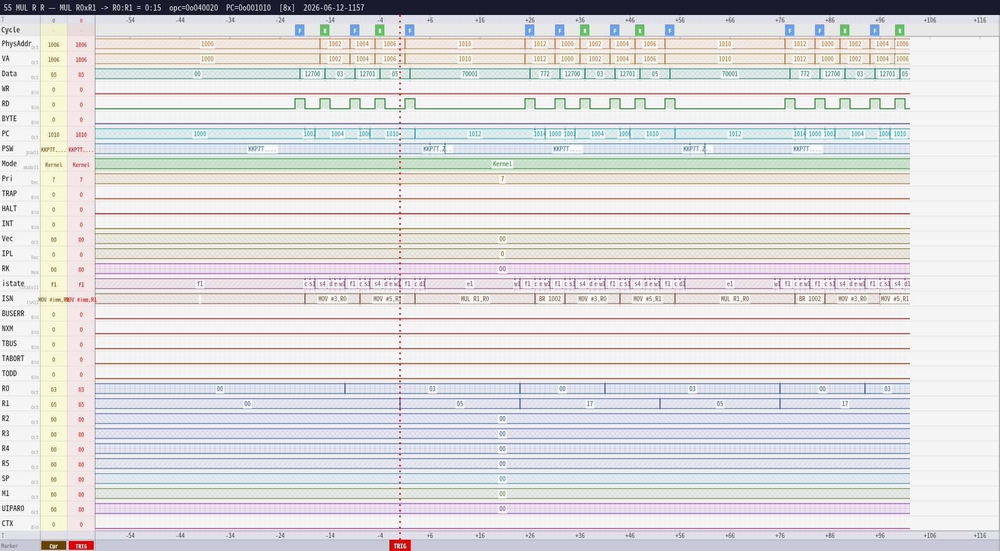

</details>

R0=`3`、R1=`5` の状態で `mul r1, r0` を実行する。

`MUL src, Rn` は `Rn` × `src` を計算し、結果 32bit を `Rn:Rn+1`（n が偶数の場合）に格納する。
R0（偶数）が対象なので積 `15=0o17` が R0:R1 に入る。
下位 16bit が `R1=0o17`、上位 16bit が `R0=0`。

ハードウェア実装は `mul1616.v` の符号付き 16×16 シーケンシャル乗算器（約 16 クロック）。
**観測ポイント**: `istate` が `e1`（execute phase）に固定されたまま r0・r1 が変化しないフラット期間。
`mul_done` アサートとともに r1 に積が現れ、istate が進む。

---

### 12.2 ケース 56 — DIV R2, R0（32÷16 除算）

<details>
<summary>タイミング図</summary>

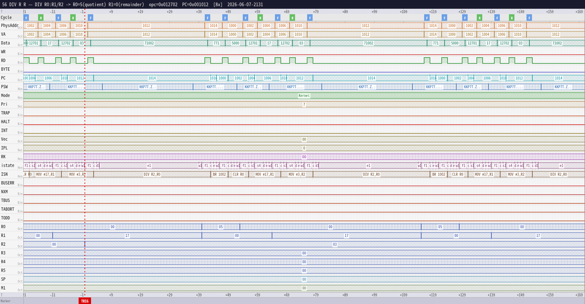

</details>

R0=`0`、R1=`0o17`（=15）、R2=`3` の状態で `div r2, r0` を実行する。

`DIV src, Rn` は `Rn:Rn+1` ÷ `src` を計算し、商を `Rn`、余数を `Rn+1` に格納する。
{R0,R1} = `{0, 0o17}` = 32bit 値 15 を R2=3 で割ると、商 `R0=5`、余数 `R1=0`。

ハードウェア実装は `div3216.v` の符号付き 32÷16 シーケンシャル除算器（約 32 クロック）。
**観測ポイント**: MUL より長い `e1` フラット期間（約 2 倍）。
`div_done` アサートで R0 に商 5 が現れる。

---

### 12.3 ケース 57 — ASH #3, R0（左シフト 3）

<details>
<summary>タイミング図</summary>

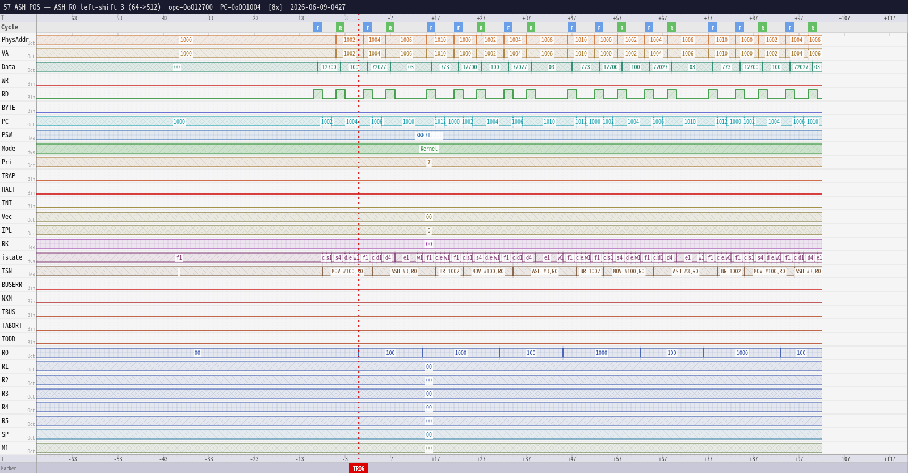

</details>

R0=`0o100`（=64）の状態で `ash $3, r0` を実行する。

`ASH cnt, Rn` は cnt が正なら左シフト、負なら算術右シフト（符号ビット保持）。
6bit の符号付き即値として解釈され、`3` → 左シフト 3 → `64 × 8 = 512 = 0o1000`。

ハードウェア実装は `shift32.v`（可変サイクルシフター）。
**観測ポイント**: MUL/DIV より短いフラット期間。シフト量に比例したサイクル数。

---

### 12.4 ケース 58 — ASH #-2, R0（右シフト 2）

<details>
<summary>タイミング図</summary>

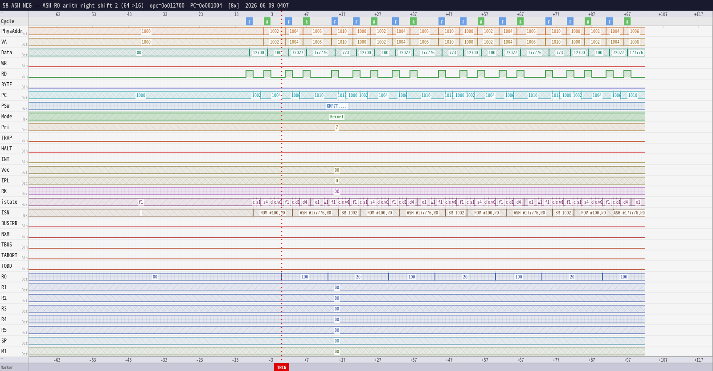

</details>

R0=`0o100`（=64）の状態で `ash $177776, r0` を実行する。

即値の下位 6bit = `0o76` = 6bit 符号付き `-2`（算術右シフト 2）。
`64 >> 2 = 16 = 0o20`。符号ビットが保持される**算術シフト**。

**観測ポイント**: `ash-pos` と同じ `shift32.v` だが、cnt の符号によって反対方向にシフトする。
右シフトでも istate のフラット期間はシフト量に比例。

---

### 12.5 ケース 59 — ASHC #4, R0（32bit 左シフト 4）

<details>
<summary>タイミング図</summary>

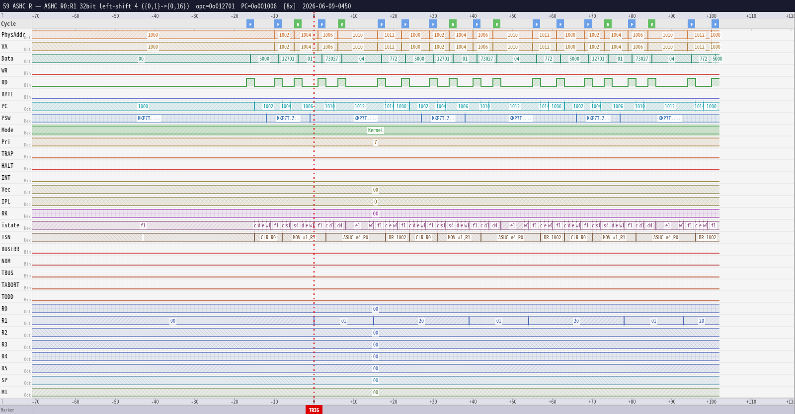

</details>

R0=`0`、R1=`1` の状態で `ashc $4, r0` を実行する。

`ASHC cnt, Rn` は `Rn:Rn+1` を 32bit として算術シフトする。
{R0,R1} = `{0, 1}` = 32bit 値 1 を左シフト 4 → 16 = `0o20`。
R0=`0`、R1=`0o20`。

**観測ポイント**: ASH の 32bit 拡張版。r0/r1 を並べて観察することで
32bit シフトがレジスタ対をまたいで動作することを確認できる。

---

### 12.6 ケース 60 — DIV ゼロ除算（V=1 abort）

<details>
<summary>タイミング図</summary>


</details>

R0=`1`、R1=`0`、R2=`0` の状態で `div r2, r0` を実行する。

除数 R2=0 のゼロ除算。RTL 内の `div3216.v` は `div_abort` 信号をアサートして
途中終了し、V フラグ（オーバーフロー）を `1` に設定する。

**観測ポイント**: 通常 DIV（ケース 56、約 32 クロック）に比べて `e1` フラット期間が大幅に短い。
`div_abort` の早期終了パスにより、ゼロ除算が検出された時点で打ち切られる。
r0・r1 の値は変更されず、V=1 のみセットされる。

---

## 13. 参考

| ドキュメント | 内容 |
|------------|------|
| [22-全命令タイミング図.md](22-全命令タイミング図.md) | T軸・istate・カテゴリ別パターンの概論 |
| [22-全命令タイミング図.md](22-全命令タイミング図.md) | 61ケースの一覧・スクリーンショット集 |
| [57-レジスタとistate.md](57-レジスタとistate.md) | istate 全値定義・1命令の実行フロー |
| [21-バスサイクル実例.md](21-バスサイクル実例.md) | Unix V6 実行中のバス波形パターン |
| `verif/web/test_timing_ss_pdp11.py` | 61ケースのテストコード（asm・trigger\_pc・desc） |
