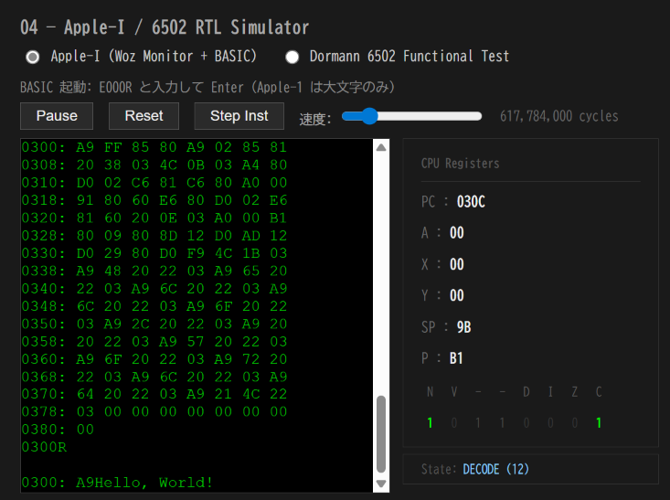

# cc65 — Apple-1 向け C 開発

cc65 で C ソースを 6502 機械語にクロスコンパイルし、
soft-FPGA Apple-1 シミュレータ上で実行するためのディレクトリ。

## インストール

```bash
sudo apt install cc65
```

## ディレクトリ構成

```text
cc65/
├── README.md        ← このファイル
├── apple1.cfg       ← リンカスクリプト（RAM $0300〜 にコードを配置）
├── Makefile         ← ビルド自動化
└── foo.c            ← Hello World サンプル
```

## Apple-1 のメモリ制約

| 項目 | 値 |
|------|-----|
| RAM | $0000–$0FFF（4 KB） |
| プログラム配置 | $0300〜（Woz Monitor 入力バッファより後） |
| スタック | $0100–$01FF（6502 固定） |
| ゼロページ | $00–$FF（Monitor/BASIC が使用中） |
| OS・ランタイム | なし（直接ハードウェアアクセス） |

## I/O レジスタ

```c
#define KBD   (*(volatile unsigned char *)0xD010)  /* キーボードデータ  */
#define KBDCR (*(volatile unsigned char *)0xD011)  /* キーボード制御    */
#define DSP   (*(volatile unsigned char *)0xD012)  /* ディスプレイデータ */
#define DSPCR (*(volatile unsigned char *)0xD013)  /* ディスプレイ制御  */
```

文字出力は `DSP` に `ASCII | 0x80` を書き、`DSPCR` の bit7 が落ちるまでビジーウェイトする。
文字入力は `KBDCR` の bit7 が立つまで待ち、`KBD` を読む。

```c
void putch(char c) {
    DSP = c | 0x80;
    while (DSP & 0x80)   /* ディスプレイが受け取るまで待機 */
        ;
}

char getch(void) {
    while (!(KBDCR & 0x80))
        ;
    return KBD & 0x7F;
}
```

## サンプル（foo.c）

```c
void main() {
    putch('H');
    putch('e');
    putch('l');
    /* ... */
}
```

## ビルド手順

```bash
make          # foo.bin を生成
make clean    # 中間ファイル（*.s *.o *.bin）を削除
```

内部では以下の 3 ステップを実行する：

```bash
# 1. コンパイル（C → アセンブリ）
cc65 -t none -O foo.c -o foo.s

# 2. アセンブル
ca65 foo.s -o foo.o

# 3. リンク（フラットバイナリ生成）
ld65 -C apple1.cfg foo.o -o foo.bin
```

`*.c` を追加すれば対応する `*.bin` が自動的にビルドターゲットに加わる。

## シミュレータへの読み込み

`make dump` で Woz Monitor 形式のダンプを出力し、貼り付けて実行する。

```bash
make dump
```

出力例：

```text
0300: A9 FF 85 80 A9 02 85 81
0308: 20 38 03 4C 0B 03 ...
...
0300R
```

## 実行例

soft-FPGA Apple-1 シミュレータで `foo.bin` を実行した結果：



`make dump` の出力を Woz Monitor に貼り付け、`0300R` で実行すると
ターミナル下部に `Hello, World!` が出力される。

## リンカスクリプト（apple1.cfg）

`$0300` スタート、`$CFF` 末端（約 52 KB）まで使用可能な設定になっているが、
実 RAM は `$0FFF` まで（4 KB）しか存在しない点に注意。

```text
MEMORY {
  RAM: start = $0300, size = $CD00, file = %O;
}
SEGMENTS {
  CODE: load = RAM, type = ro;
  DATA: load = RAM, type = rw;
  BSS:  load = RAM, type = bss;
}
```

RAM サイズを実機に合わせる場合は `size = $0D00` に変更する。

## 制約事項

- `printf` / `malloc` など C 標準ライブラリは使えない
- `long long`（64bit 整数）非対応
- RAM 4 KB のため、大きな配列・深い再帰は不可
- BSS ゼロクリアなど C ランタイム初期化は自前が必要な場合がある

## 参考

- [docs/04-6502/03-開発ツール.md](../../../../docs/04-6502/03-開発ツール.md) — cc65 / llvm-mos 比較・選定根拠
- [docs/04-6502/52-メモリマップ.md](../../../../docs/04-6502/52-メモリマップ.md) — Apple-1 メモリ・I/O アドレス一覧
- [cc65 公式ドキュメント](https://cc65.github.io/doc/)
