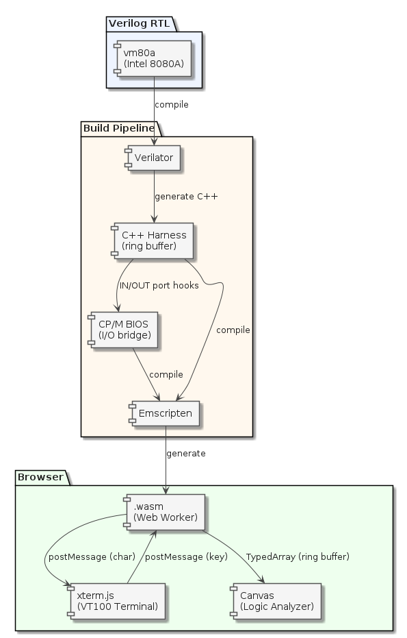

# 06-8080 — Intel 8080 RTL シミュレータ

vm80a（Intel 8080A のデキャップ起こし RTL）を Verilator で C++ 化し、
soft-FPGA として動かすサンプル。上位レイヤとして CP/M 2.2 を動作させる。

## アーキテクチャ



## ディレクトリ構成

```text
06-8080/
├── README.md          ← このファイル
├── verilog/           ← vm80a RTL（要配置）
├── cxx/               ← C++ ハーネス・Emscripten ビルド（要実装）
├── web/               ← xterm.js UI（要実装）
└── sw/
    └── cpm/           ← CP/M 2.2 BIOS・ディスクイメージ
```

## 8080 vs 6502

| 項目 | 8080（このディレクトリ） | 6502（04-6502） |
|------|------------------------|-----------------|
| RTL | vm80a（デキャップ起こし） | gianlucag/6502 |
| RAM | 64 KB フラット | 4 KB（Apple-1） |
| OS | CP/M 2.2 | なし（Woz Monitor + BASIC ROM） |
| I/O | IN/OUT ポート命令 | メモリマップド（PIA $D010-D013） |
| ターミナル | xterm.js（VT100） | xterm.js（Apple-1 表示） |

## vm80a について

vm80a は NEC D8080AFC のデキャップ画像から起こされた Verilog RTL。
バグ互換（bug-for-bug）・未定義挙動・タイミング・割り込み応答が実機と一致する。

- リポジトリ: `https://github.com/1801BM1/vm80a`
- ライセンス: MIT

## 参考

- [sw/cpm/README.md](sw/cpm/README.md) — CP/M 2.2 構成・BIOS 実装方針
- [docs/01-soft-FPGA-WebAssembly-設計議論メモ.md](../../docs/01-soft-FPGA-WebAssembly-設計議論メモ.md) — CP/M WASM 化の設計方針
